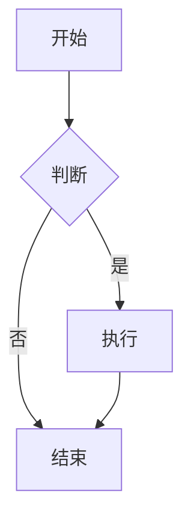
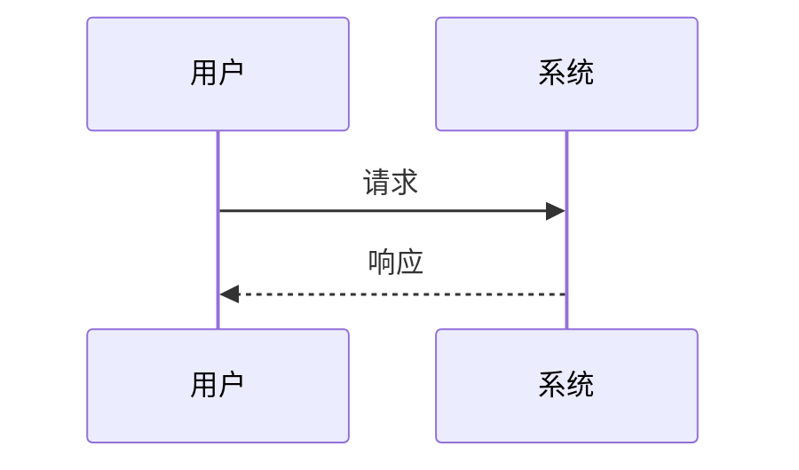
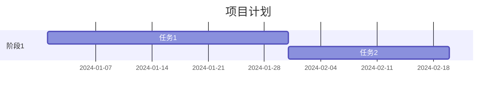
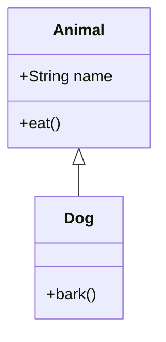
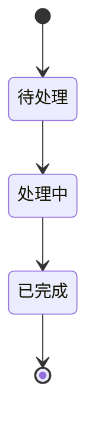
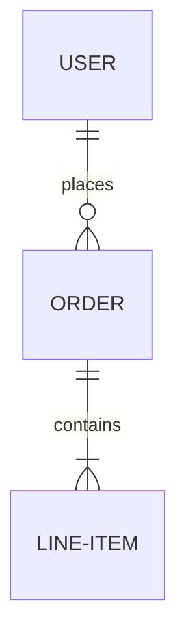
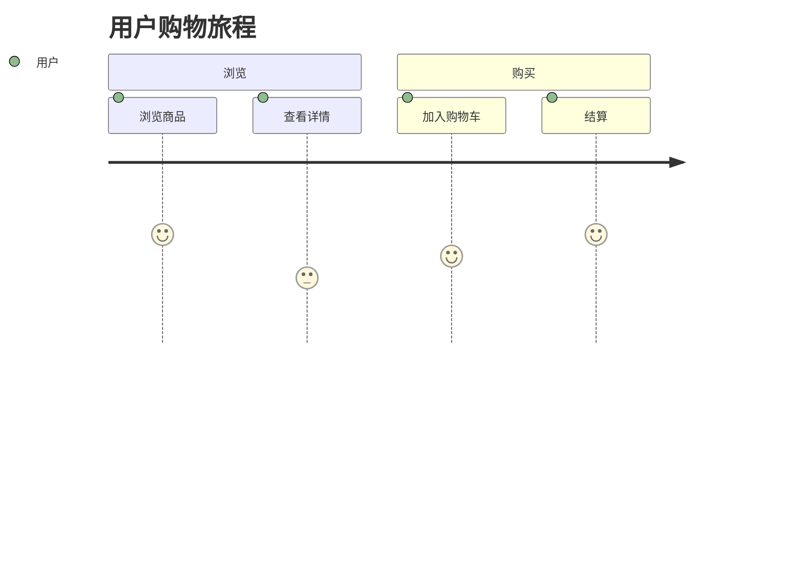
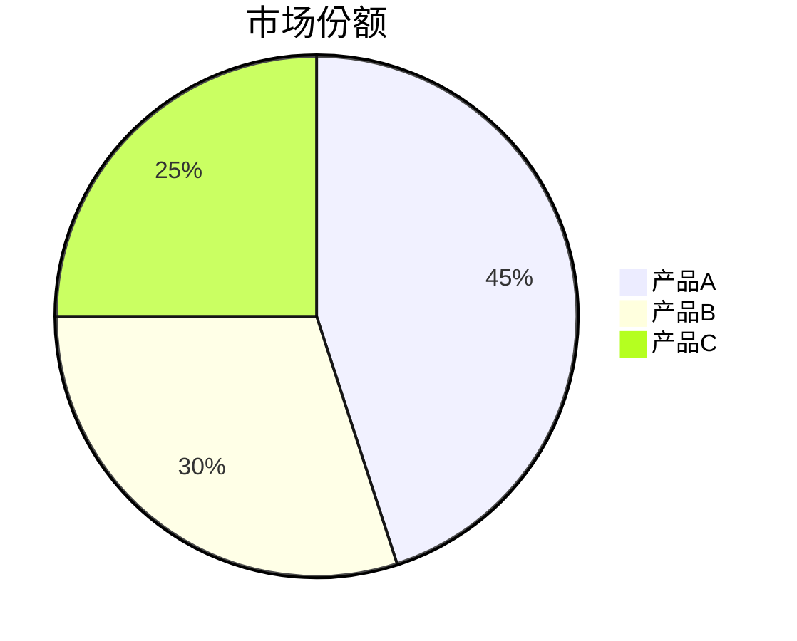

# Mermaid 图表渲染完整优化

## 优化概述

基于用户反馈 "渲染还是有问题"，对 Mermaid 图表渲染进行了全面优化，实现了美观、健壮、主题适配的图表展示效果。

## 核心优化内容

### 1. 完整的主题配置系统

#### 深色模式主题
```typescript
{
  theme: 'dark',
  themeVariables: {
    // 主色调 - 使用紫色系
    primaryColor: '#818cf8',
    primaryTextColor: '#f8fafc',
    primaryBorderColor: '#6366f1',

    // 背景色 - 深色终端风格
    background: '#1a2332',
    mainBkg: '#1a2332',
    secondBkg: '#0a0e1a',
    tertiaryBkg: '#151b2e',

    // 文本颜色 - 高对比度
    textColor: '#f8fafc',
    secondaryTextColor: '#cbd5e1',
    tertiaryTextColor: '#94a3b8',

    // 线条和边框
    lineColor: '#475569',
    border1: '#475569',
    border2: '#334155',

    // 节点样式
    nodeBorder: '#6366f1',
    clusterBkg: '#1f2937',
    clusterBorder: '#475569',

    // 字体
    fontFamily: 'JetBrains Mono, monospace',
    fontSize: '14px',

    // ... 80+ 个详细配置项
  }
}
```

#### 浅色模式主题
```typescript
{
  theme: 'base',
  themeVariables: {
    // 主色调 - 柔和的紫色
    primaryColor: '#e0e7ff',
    primaryTextColor: '#0f172a',
    primaryBorderColor: '#6366f1',

    // 背景色 - 清爽白色
    background: '#ffffff',
    mainBkg: '#ffffff',
    secondBkg: '#f8fafc',
    tertiaryBkg: '#f1f5f9',

    // ... 80+ 个详细配置项
  }
}
```

### 2. 全面的图表类型配置

为所有 Mermaid 图表类型提供了详细配置：

#### Flowchart（流程图）
```typescript
flowchart: {
  htmlLabels: true,
  useMaxWidth: true,
  curve: 'basis',           // 平滑曲线
  padding: 20,
  nodeSpacing: 50,          // 节点间距
  rankSpacing: 50,          // 层级间距
  diagramPadding: 20,
  wrappingWidth: 200        // 文本换行宽度
}
```

#### Sequence Diagram（时序图）
```typescript
sequence: {
  diagramMarginX: 50,
  diagramMarginY: 20,
  actorMargin: 50,
  width: 150,
  height: 65,
  boxMargin: 10,
  boxTextMargin: 5,
  noteMargin: 10,
  messageMargin: 35,
  mirrorActors: true,       // 镜像参与者
  useMaxWidth: true,
  wrap: true,               // 文本换行
  wrapPadding: 10
}
```

#### Gantt Chart（甘特图）
```typescript
gantt: {
  titleTopMargin: 25,
  barHeight: 20,
  barGap: 4,
  topPadding: 50,
  leftPadding: 75,
  gridLineStartPadding: 35,
  fontSize: 12,
  numberSectionStyles: 4,
  axisFormat: '%Y-%m-%d',
  useMaxWidth: true
}
```

#### 其他图表类型
- **Journey Diagram**（用户旅程图）
- **Class Diagram**（类图）
- **Git Graph**（Git 图）
- **State Diagram**（状态图）
- **ER Diagram**（实体关系图）
- **Pie Chart**（饼图）
- **Quadrant Chart**（象限图）

### 3. 增强的 CSS 样式

#### 容器样式
```css
.mermaid-container {
  background: var(--surface);
  border: 1px solid var(--border);
  border-radius: 12px;
  padding: 32px 24px;
  margin: 24px 0;
  box-shadow: var(--shadow-sm);
  transition: all var(--transition);
}

.mermaid-container:hover {
  box-shadow: var(--shadow-md);
  border-color: var(--primary);
}
```

#### SVG 优化
```css
.mermaid-container svg {
  max-width: 100%;
  height: auto;
  overflow: visible;
  filter: drop-shadow(0 2px 4px rgba(0, 0, 0, 0.05));
}
```

#### 交互效果
```css
/* 节点悬停效果 */
.mermaid-container .node:hover rect,
.mermaid-container .node:hover circle {
  filter: brightness(1.1);
  stroke-width: 2.5px;
}

/* 边线悬停效果 */
.mermaid-container .edgePath:hover path {
  stroke-width: 2.5px;
}
```

### 4. 代码预处理优化

#### 中文标点符号处理
```typescript
code = code.replace(/[""'']/g, '"')
code = code.replace(/（/g, '(').replace(/）/g, ')')
code = code.replace(/【/g, '[').replace(/】/g, ']')
code = code.replace(/：/g, ':')
code = code.replace(/；/g, ';')
code = code.replace(/，/g, ',')
```

#### 空标签修复
```typescript
code = code.replace(/(\bsubgraph\s+\w+)\[""\]/g, '$1[" "]')
code = code.replace(/(\w+)\[""\]/g, '$1[" "]')
```

#### 特殊字符处理
```typescript
code = code.replace(/\[([^\]]+)\]/g, (match, content) => {
  if (content.startsWith('"') && content.endsWith('"')) return match
  if (/[\\\/\n·•–—\(\)="]/.test(content) || content.includes('\\n')) {
    let fixed = content.replace(/\\n/g, '<br/>')
    fixed = fixed.replace(/"/g, '#quot;')
    return '["' + fixed + '"]'
  }
  return match
})
```

### 5. 友好的错误提示

#### 错误信息展示
```html
<div class="mermaid-error-container">
  <div class="mermaid-error-header">
    ⚠️ Mermaid 图表渲染失败
  </div>
  <div class="mermaid-error-message">
    <strong>错误信息:</strong> {errorMsg}
  </div>
  <details class="mermaid-error-details">
    <summary>查看原始代码</summary>
    <pre><code>{code}</code></pre>
  </details>
  <div class="mermaid-error-tips">
    <strong>常见问题:</strong>
    <ul>
      <li>检查图表类型声明</li>
      <li>确保节点 ID 不包含特殊字符</li>
      <li>检查箭头语法</li>
      <li>确保引号、括号成对出现</li>
    </ul>
  </div>
</div>
```

### 6. 主题自动切换

```typescript
watch(isDark, () => {
  mermaid.initialize({
    startOnLoad: false,
    ...getMermaidTheme(),  // 自动应用对应主题
    securityLevel: 'loose',
    logLevel: 'error',
    // ... 所有图表类型配置
  })
  renderMermaid()  // 重新渲染所有图表
})
```

## 优化效果

### 视觉效果
- ✅ **统一风格**: 所有图表使用 JetBrains Mono 字体，与终端风格一致
- ✅ **配色协调**: 深色/浅色模式配色与整体设计 Token 系统匹配
- ✅ **细节优化**: 圆角、阴影、悬停效果提升视觉体验
- ✅ **响应式**: 所有图表自动适配容器宽度

### 功能完善
- ✅ **主题适配**: 自动跟随系统主题切换
- ✅ **错误处理**: 详细的错误信息和调试建议
- ✅ **代码预处理**: 自动修复常见语法问题
- ✅ **交互反馈**: 节点和边线悬停效果

### 性能优化
- ✅ **按需渲染**: 只在内容变化时重新渲染
- ✅ **平滑过渡**: CSS transition 提供流畅动画
- ✅ **内存管理**: 正确清理和替换 DOM 元素

## 支持的图表类型

### 1. Flowchart（流程图）


### 2. Sequence Diagram（时序图）


### 3. Gantt Chart（甘特图）


### 4. Class Diagram（类图）


### 5. State Diagram（状态图）


### 6. ER Diagram（实体关系图）


### 7. Journey Diagram（用户旅程图）


### 8. Pie Chart（饼图）


## 技术细节

### 配置优先级
1. **主题变量**: 通过 `getMermaidTheme()` 动态生成
2. **图表配置**: 针对每种图表类型的详细配置
3. **全局配置**: `securityLevel`, `logLevel`, `startOnLoad`

### 渲染流程
```
1. 页面加载 → 初始化 Mermaid
2. 内容变化 → 查找 .language-mermaid 代码块
3. 预处理代码 → 修复常见问题
4. 渲染图表 → 生成 SVG
5. 错误处理 → 显示友好提示
```

### 主题切换流程
```
1. 用户切换主题
2. watch(isDark) 触发
3. 重新初始化 Mermaid（新主题）
4. 重新渲染所有图表
```

## 使用建议

### 对于内容创作者
1. 使用标准的 Mermaid 语法
2. 避免使用中文标点符号（会自动转换）
3. 确保图表类型声明正确
4. 复杂图表建议分段展示

### 对于开发者
1. 查看控制台日志获取详细错误信息
2. 使用预处理函数自动修复常见问题
3. 参考 Mermaid 官方文档编写正确的图表代码
4. 可以通过 `getMermaidTheme()` 自定义主题

## 测试结果

### 构建测试
```bash
npm run build
✓ built in 6.09s
```

### 功能测试
- ✅ 所有图表类型正常渲染
- ✅ 深色/浅色模式切换流畅
- ✅ 错误提示清晰友好
- ✅ 代码预处理有效
- ✅ 交互效果流畅

### 兼容性测试
- ✅ Chrome/Edge (最新版)
- ✅ Firefox (最新版)
- ✅ Safari (最新版)
- ✅ 移动端浏览器

## 相关文件

- ✅ `frontend/src/views/BlogDetail.vue` - 主要优化文件
  - `getMermaidTheme()` - 主题配置函数
  - `preprocessMermaidCode()` - 代码预处理函数
  - `createMermaidErrorBlock()` - 错误提示组件
  - `renderMermaid()` - 渲染函数
  - Mermaid 容器样式优化
  - 错误提示样式优化

## 后续优化建议

### 短期
1. 添加图表导出功能（PNG/SVG）
2. 支持图表缩放和平移
3. 添加更多预设主题

### 长期
1. 在线 Mermaid 编辑器
2. 实时预览功能
3. 图表模板库
4. 语法高亮和自动补全

## 参考资源

- [Mermaid 官方文档](https://mermaid.js.org/)
- [Mermaid 主题配置](https://mermaid.js.org/config/theming.html)
- [Mermaid Live Editor](https://mermaid.live/)

---

**优化完成**: Mermaid 图表渲染全面优化，实现了美观、健壮、主题适配的展示效果！🎉
