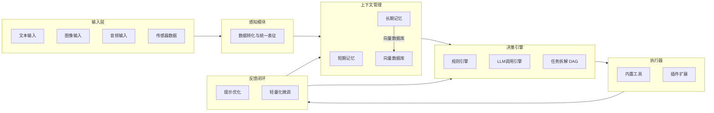
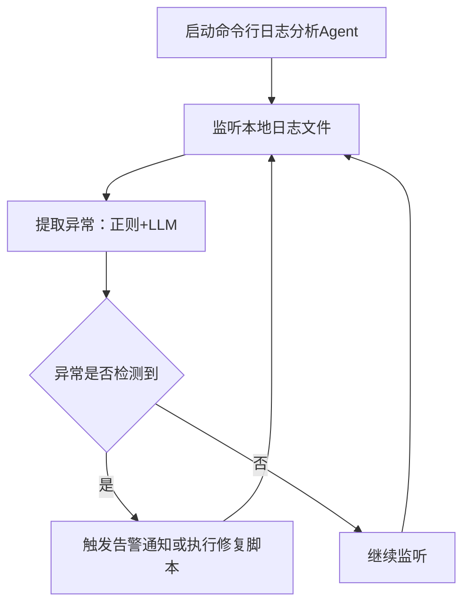
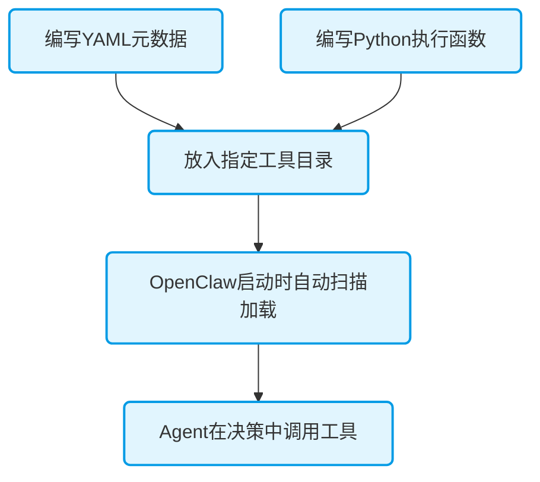
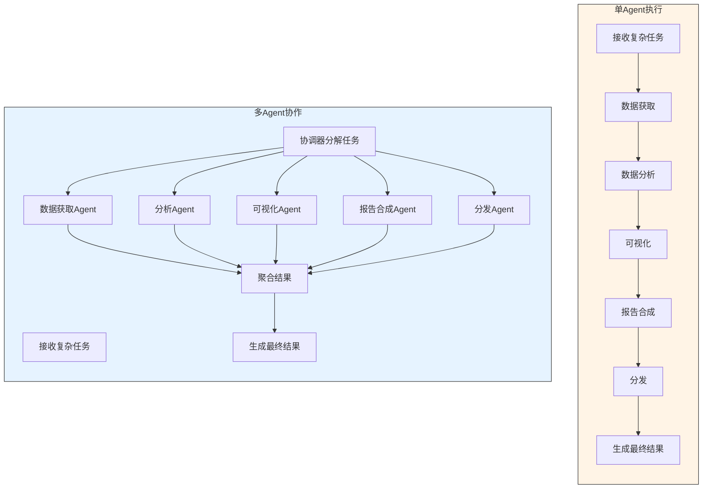

> **TL;DR** OpenClaw深度解析：一个MIT开源的本地优先AI Agent执行网关，从技术背景到实战构建。学习其模块化架构、自定义工具开发和多模态接入，掌握部署专属智能体的技巧。适合中级开发者探索AI Agent技术。


---


# OpenClaw深度解析与专属Agent构建指南：从原理到实战

## 技术向 | 架构拆解 | 实战教程 | 代码示例

**阅读时间**: 60 min
> 本文提供从原理到实战的完整指南，通过具体代码示例和架构拆解，帮助开发者深入理解OpenClaw并构建可部署、可扩展的技术型Agent。

## 目录

- [一、OpenClaw技术背景与定位：从‘能说’到‘能做’的AI Agent演进](#一openclaw技术背景与定位从‘能说’到‘能做’的ai-agent演进)
  - [1.1 诞生背景：AI Agent执行的挑战与机遇](#1.1-诞生背景ai-agent执行的挑战与机遇)
  - [1.2 设计哲学：模块化、轻量化、可插拔、本地优先](#1.2-设计哲学模块化轻量化可插拔本地优先)
  - [1.3 与现有技术路线的对比：LangChain vs AutoGPT vs CrewAI](#1.3-与现有技术路线的对比langchain-vs-autogpt-vs-crewai)
- [二、系统架构深度拆解：从输入到反馈的完整闭环](#二系统架构深度拆解从输入到反馈的完整闭环)
  - [2.1 整体架构概览：从多模态输入到反馈闭环](#2.1-整体架构概览从多模态输入到反馈闭环)
  - [2.2 感知模块：多模态输入应对与接入方式](#2.2-感知模块多模态输入应对与接入方式)
  - [2.3 上下文管理：记忆机制与向量数据库集成](#2.3-上下文管理记忆机制与向量数据库集成)
  - [2.4 决策引擎：混合决策与任务编排](#2.4-决策引擎混合决策与任务编排)
  - [2.5 执行器：工具调用与插件扩展规范](#2.5-执行器工具调用与插件扩展规范)
  - [2.6 反馈闭环：学习与优化机制](#2.6-反馈闭环学习与优化机制)
- [三、开发者实战：环境配置与快速启动](#三开发者实战环境配置与快速启动)
  - [3.1 环境要求与安装：Python依赖和Docker选项](#3.1-环境要求与安装python依赖和docker选项)
  - [3.2 最小化示例：命令行日志分析Agent代码解析](#3.2-最小化示例命令行日志分析agent代码解析)
  - [3.3 运行与调试：启动Agent并验证结果](#3.3-运行与调试启动agent并验证结果)
- [四、核心功能开发详解：自定义工具与多模态接入](#四核心功能开发详解自定义工具与多模态接入)
  - [4.1 自定义工具开发：从定义到注册的完整流程](#4.1-自定义工具开发从定义到注册的完整流程)
  - [4.2 多模态接入：图像与音频解决实战](#4.2-多模态接入图像与音频解决实战)
  - [4.3 知识库扩展：向量数据库与RAG集成](#4.3-知识库扩展向量数据库与rag集成)
- [五、高级特性实践与性能调优：多Agent协作与安全控制](#五高级特性实践与性能调优多agent协作与安全控制)
  - [5.1 多Agent协作与状态持久化](#5.1-多agent协作与状态持久化)
  - [5.2 安全控制：权限管理与沙箱执行](#5.2-安全控制权限管理与沙箱执行)
  - [5.3 性能调优：延迟优化与资源分析](#5.3-性能调优延迟优化与资源分析)
- [六、开源生态与技术展望：贡献与未来方向](#六开源生态与技术展望贡献与未来方向)
  - [6.1 源码结构与插件开发指南](#6.1-源码结构与插件开发指南)
  - [6.2 商业化集成与未来技术方向](#6.2-商业化集成与未来技术方向)
  - [6.3 贡献指南与社区参与](#6.3-贡献指南与社区参与)

---

随着AI Agent技术从聊天能力向实际任务执行演进，开发者面临集成复杂性、隐私安全和部署灵活性的挑战。OpenClaw作为一个MIT开源、本地优先的AI Agent执行网关，旨在通过模块化设计解决这些痛点，实现从‘能说’到‘能做’的转变。本文将深度解析OpenClaw的技术架构，并提供从零构建专属Agent的实战指南，涵盖环境配置、代码示例和优化技巧，帮助中级开发者掌握这一强大工具。

---

## 一、OpenClaw技术背景与定位：从‘能说’到‘能做’的AI Agent演进

AI技术的浪潮正从智能对话快速涌向智能执行。ChatGPT等大语言模型展现出惊人的“能说”能力，它们可以生成文本、解答疑问甚至创意写作。然而，当我们将目光投向更复杂的现实世界——自动整理会议纪要、分析服务器日志、根据草图生成前端代码——一个根本性的挑战出现了：如何让AI不仅能够“说”，还能够“做”？这正是OpenClaw诞生的起点。它是一个旨在打通AI认知能力与实际任务执行之间“最后一公里”的桥梁，其核心定位是成为一个**MIT开源、本地优先的AI Agent执行网关**<sup><a href="#ref-1" data-source-url="Anthropic Research">[1]</a></sup>，致力于让开发者能够轻松构建一个能安全、可控、高效完成具体工作的专属智能体。
> 在由大语言模型驱动的智能体发展路径上，OpenClaw选择了一条不同的技术路线。它它聚焦于成为一个轻量、坚固、可插拔的“执行中枢”，而不是试图构建全知全能的巨型智能体，优先保证在您的本地环境中可靠地完成任务。

### 1.1 诞生背景：AI Agent执行的挑战与机遇

近年来，围绕AI Agent的框架和工具层出不穷，它们大多解决的是“如何更好地思考和规划”的问题。例如，LangChain通过链式编排为LLM调用增加复杂的逻辑流程，AutoGPT尝试让AI通过自我迭代完成目标，CrewAI则专注于多智能体间的协作分工。这些探索极大地丰富了AI的应用场景，但当开发者真正尝试将智能体部署到生产环境，尤其是涉及企业内部流程或敏感数据时，几个棘手的瓶颈便浮出水面。
首先，**数据隐私与安全可控性**是首要顾虑。许多现有方案严重依赖云端API，企业核心数据（如客户信息、内部文档、系统日志）的流转路径变得不可控。其次，**集成的复杂性**令人望而却步。让AI执行一个真实任务，往往需要它调用本地命令行工具、访问内部数据库、操作特定软件（如Photoshop、Excel），或与硬件设备交互。将这些异构系统顺畅地接入AI的决策循环，通常意味着繁重的定制开发工作。最后，**稳定性和可解释性**也是关键。一个在云端运行良好的智能体，可能因为网络延迟、API速率限制或服务变更而在关键时刻失灵，且其内部决策过程往往像一个黑箱，难以审计和调试。
因此，市场呼唤一个能将AI的“大脑”（大语言模型）与无数“手脚”（本地工具和系统）安全、灵活连接起来的“神经系统”。这个系统需要原生为本地环境设计，对数据流有完全的控制权；它需要足够模块化，以便轻松集成任何现有工具；它还需要足够轻量，可以运行在从开发者的笔记本电脑到边缘服务器的各种设备上。OpenClaw正是为回应这些需求而设计，它从架构上就将**本地优先**和**模块化**作为第一原则，旨在成为企业构建私有化、高可控性AI自动化流程的基石<sup><a href="#ref-1" data-source-url="Anthropic Research">[1]</a></sup>。

### 1.2 设计哲学：模块化、轻量化、可插拔、本地优先

OpenClaw的独特之处，源于其清晰且坚定的设计哲学。这四项原则是彼此支撑、共同定义其技术形态的核心理念，而不仅仅是简单的功能清单。
**1. 本地优先：隐私与控制的基石**
“本地优先”是OpenClaw最鲜明的标签。这意味着它被设计为优先在用户自有的硬件环境（个人电脑、内部服务器、私有云）中运行。所有数据的处理、模型的推理以及任务的执行，都发生在您可控的边界内。这与完全依赖OpenAI或Anthropic等云端服务的方案形成鲜明对比。本地优先直接回应了企业对数据隐私、合规性以及服务连续性的刚性需求。您的敏感数据无需离开内部网络，避免了因第三方API导致的潜在泄露风险。同时，这也意味着您可以在完全离线的环境中部署和运行智能体，这对于某些涉密场景或网络不稳定环境关键。
**2. 模块化：构建专属智能体的乐高积木**
OpenClaw将AI Agent的完整工作流解构成了清晰、独立的模块，例如感知模块（处理输入）、决策引擎（规划和调用工具）、执行器（运行具体工具）以及上下文管理（维护记忆）。这种模块化设计带来了两大优势：**易于扩展**和**便于维护**。开发者可以像拼装乐高积木一样，替换或增强任何一个环节。如果您需要接入一种新的输入方式（如工业传感器数据），只需在感知层增加一个对应的模块；如果想换用另一款大语言模型，也只需调整决策引擎的配置，而无需重写整个系统。
**3. 可插拔：集成您的一切工具**
模块化在实践中的体现，就是极致的可插拔性。OpenClaw定义了简洁的工具接口，任何可以通过代码调用的功能——无论是调用一个Python函数、执行一段Shell命令、发送一个HTTP请求，还是操作一个桌面应用——都可以被封装成一个“工具”，并轻松插入到OpenClaw的执行器中。系统启动时会自动发现并加载这些工具，智能体在决策时便能立即获知并使用它们。这显著改变了AI与现有系统集成的范式，从“为AI改造世界”变为“将世界接入AI”。
**4. 轻量化：让智能体无处不在**
尽管功能强大，OpenClaw追求轻量化实现。它本身是一个高效的任务编排与执行调度系统，而不是重型的机器学习框架。其核心运行时资源占用低，允许它在资源有限的边缘设备（如树莓派、工控机）上稳定运行。轻量化也意味着更快的启动速度和更低的运维成本，使得快速原型验证和大规模部署都更加可行。
![OpenClaw深度解析与专属Agent构建指南 · 提示词
一、技术背景与定位
OpenClaw的诞生背景：解决什么问题？与LangChain、AutoGPT、CrewAI等技术路线的区别。
核心设计哲学：模块化、轻量化、可插拔、本地优先（是否支持离线运行）。
适用场景：自动化流程编排、本地智能体服务、多模态交互任务。
二、系统架构深度拆解
整体架构图（文字描述）：输入层（多模态）→ 感知模块 → 上下文管理 → 决策引擎 → 执行器 → 反馈闭环。
核心模块详解：
感知模块：支持哪些模态（图像/音频/文本/传感器）？接入方式（SDK/插件/自定义模型）？
上下文管理：短期记忆与长期记忆的实现机制（向量数据库/缓存策略/会话窗口管理）。
决策引擎：
规则引擎与LLM调用的混合决策机制
是否支持动态加载模型（如本地Llama、API调用GPT、专用小模型）
任务拆解与执行顺序编排（DAG/状态机）
执行器：内置工具（文件操作/网络请求/系统命令）与自定义插件扩展方式。
反馈与学习：是否支持基于执行结果的轻量化微调或提示词优化。
三、开发者实战：从零构建一个技术型Agent
3.1 环境与快速启动
环境要求：Python版本、依赖安装（pip/conda）、Docker镜像（如有）。
最小化示例：一个“命令行日志分析Agent”
监听本地日志文件
使用正则+LLM提取异常
触发告警或自动修复脚本
完整代码展示（含注释）
3.2 核心功能开发详解
自定义工具开发
工具定义规范（输入输出格式、异常处理）
示例：开发一个“Git仓库状态检查工具”
如何注册到OpenClaw工具库
多模态能力接入
图像输入处理（如接入YOLO + 描述生成）
音频指令解析（本地Whisper接入示例）
知识库扩展
如何接入向量数据库（Chroma/FAISS）
动态知识检索增强生成（RAG）的实现细节
3.3 高级特性实践
多Agent协作：Agent间通信协议、任务分发与结果聚合。
状态持久化：会话保存/恢复机制，长期记忆存储方案。
安全与权限控制：工具执行权限、敏感信息过滤、沙箱机制。
四、性能调优与调试技巧
日志与监控：内置调试模式、可视化追踪工具（如有）。
响应延迟优化：模型量化、缓存策略、异步执行。
资源占用分析：CPU/内存/显存消耗，边缘设备部署可行性。
五、开源生态与二次开发建议
源码结构解析（核心模块路径、插件目录、配置文件格式）。
如何提交自定义插件到官方仓库（如有）。
基于OpenClaw的商业化/内部系统集成思路（API封装、微服务化）。
六、技术展望
未来Roadmap中值得关注的技术方向（如多模态统一模型、在线学习能力）。
开发者可贡献的方向（性能优化、新工具插件、文档共建）。
补充说明（供AI参考）：
语言风格：专业、精准、带有代码片段和配置示例。
如果OpenClaw是虚构/尚未发布的技术，请基于现有开源智能体框架（如AutoGPT、AgentGPT、Open Interpreter等）的技术趋势进行合理推演。
涉及代码时，使用Python为主，必要时可展示JSON配置或YAML格式。
技术细节尽可能具体，避免“提供了强大功能”这类模糊描述，改为“支持通过plugin.yml定义工具元数据，包含name、description、input_schema字段”。](placeholder.png)
这四项设计哲学相互关联：本地优先要求架构必须轻量且可控；模块化是实现可插拔和灵活扩展的基础；而可插拔性又使得在轻量化的核心上能够承载无限复杂的功能。它们共同指向同一个目标：**降低将AI转化为实际生产力的门槛和风险**。

### 1.3 与现有技术路线的对比：LangChain vs AutoGPT vs CrewAI

要真正理解OpenClaw的定位，最好的方式是将它置于当前流行的AI Agent技术图谱中进行对比。LangChain、AutoGPT和CrewAI代表了不同的技术路线和优化方向，而OpenClaw则瞄准了一个被相对忽视但关键的细分市场。
**LangChain：专注于“编排”的瑞士军刀**
LangChain本质上是一个用于构建由LLM驱动的应用程序的**框架**。它提供了丰富的组件（如链、代理、记忆体）和工具集成，其强项在于复杂逻辑的编排和与各种外部数据源（如向量数据库）的连接。然而，LangChain更多是解决“如何让LLM更好地利用工具进行思考”，对于工具在**本地环境下的安全、沙箱化执行**，以及整个系统的轻量化部署，不是其设计重点。开发者常常需要自行解决执行环境隔离、权限控制等生产级问题。
**AutoGPT：追求自主目标的实验性探索**
AutoGPT是一种旨在实现给定目标完全自主执行的**项目范式**。它利用让AI自我提示、迭代来尝试完成任务，展示了强大的自主性潜力。但其设计更偏向于实验和演示，在稳定性、资源消耗（尤其是无限制的API调用）以及对复杂、长效任务的可控性方面存在明显短板，难以直接应用于需要可靠性和预算控制的商业场景。
**CrewAI：高效的多智能体协作框架**
CrewAI专注于**多智能体协作**，借助定义角色、任务和目标，让多个AI智能体像团队一样分工合作。它在需要多步骤、多专长协作的复杂任务规划上表现出色。与OpenClaw相比，CrewAI侧重于“上层建筑”——智能体间的协同与任务分解，而OpenClaw侧重于“底层基础”——单个智能体如何安全、可靠地执行一个个具体的原子动作。两者在理念上并不对立，而是有互补潜力：用CrewAI进行高阶规划和分工，用OpenClaw来可靠地执行每个分工任务。
**OpenClaw：本地优先的“执行网关”**
凭借对比，我们可以清晰地看到OpenClaw的本质区别：它是一个以**执行为核心**、以**本地环境为默认战场**的**网关**或**运行时**。它不替代LangChain的复杂编排能力，但为编排好的任务提供了更安全可靠的本地执行环境；它不像AutoGPT那样追求完全自主，但为每一步自主决策提供了扎实、可控的执行保障；它可以与CrewAI这样的协作框架结合，成为其旗下各个智能体强力而可靠的“四肢”。
| 特性维度 | LangChain | AutoGPT | CrewAI | **OpenClaw** |
| :------------- | :----------------- | :----------------- | :----------------- | :--------------------- |
| **核心定位** | LLM应用开发框架 | 自主智能体实验范式 | 多智能体协作框架 | **本地AI Agent执行网关** |
| **设计重心** | 工具调用与逻辑编排 | 目标驱动的自主迭代 | 角色分工与团队协作 | **安全、可控的任务执行** |
| **部署模式** | 环境依赖性强 | 通常依赖云端API | 环境依赖性强 | **本地优先，原生支持离线** |
| **数据流** | 可配置，常混合云端 | 严重依赖云端API | 可配置 | **默认完全本地，隐私优先** |
| **集成复杂度** | 中等，需较多配置 | 低，但不可控 | 中等 | **低，标准化可插拔接口** |
| **生产就绪度** | 高 | 低 | 中 | **高，强调安全与控制** |
> OpenClaw并非要推翻现有的AI Agent生态，而是填补了从“智能决策”到“物理执行”之间的关键空白。它让开发者能够以最小的成本和风险，将大语言模型的“思考”能力，转化为在本地环境中看得见、摸得着的“行动”结果。
OpenClaw的出现，回应了AI Agent技术工业化落地过程中最实际的需求。它经由**本地优先**的设计保障了隐私与控制，利用**模块化**与**可插拔**的架构达成了极致的灵活性，借助**轻量化**的追求拓宽了部署边界。无论您是希望构建一个自动分析日志的运维助手，一个处理内部文档的行政秘书，还是一个能与智能家居交互的个人管家，OpenClaw都给出了一套可靠、安全且高度自由的基础设施，让您的AI想法得以安全落地，真正从“能说”走向“能做”。

---

## 二、系统架构深度拆解：从输入到反馈的完整闭环

OpenClaw的设计目标是从“能说”迈向“能做”，这一跨越的实现依赖于一个严谨且模块化的分层架构。这个架构将复杂的任务执行过程分解为一系列可管理、可扩展的环节，确保Agent既能理解多样化的世界信息，又能做出可靠的决策并执行具体操作。本章将深入剖析这一架构，揭示其从多模态输入到反馈学习的完整闭环是如何运作的。

### 2.1 整体架构概览：从多模态输入到反馈闭环

OpenClaw的整体架构可以被视为一个高效的信息处理与行动生成流水线。它遵循“感知-思考-行动-学习”的经典智能体范式，但在每一层都进行了工程化的精细设计。

*OpenClaw系统架构图，展示输入层、感知模块、上下文管理、决策引擎、执行器和反馈闭环的数据流与模块交互*
流程始于**输入层**。与传统的聊天机器人仅处理文本不同，OpenClaw被设计为世界的“多模态接口”。它可以直接接收图像文件、音频片段、结构化文本，甚至未来可扩展的传感器数据流。这种设计让Agent能够“看到”截图、“听到”指令录音，为处理真实世界任务奠定了基础。
原始输入被送入**感知模块**。此模块的核心职责是将异构数据转化为系统能够理解的统一表征。例如，它可能调用一个视觉模型（如CLIP）为图像生成描述，或使用语音转文本服务解决音频。其设计关键在于通过标准化协议（如后文将详述的MCP）来接入各种应对能力，保持架构的简洁与可扩展性。
经过化解的信息流入**上下文管理**模块，这是Agent的“记忆中枢”。它不仅要管理当前会话的短期上下文（即对话历史），更重要的是维护一个由向量数据库支撑的长期记忆。当遇到新问题时，系统可以从中快速检索相关历史经验或知识文档，为决策提供背景和依据。这便是RAG（检索增强生成）机制发挥作用的地方。
基于丰富的上下文，**决策引擎**开始工作。这是整个系统的“大脑”，采用混合决策模式。对于简单、确定的规则（如“如果是系统日志文件，则调用日志分析工具”），由内置的规则引擎快速管理；对于复杂、开放性的任务（如“分析这张图表并总结趋势”），则交由大语言模型进行推理和规划。决策引擎会将复杂任务拆解成子任务，并编排成一个有向无环图（DAG）来管理执行顺序和依赖关系。
具体行动由**执行器**落实。它管理着一个动态的工具库，包含文件读写、网络请求等内置操作，更重要的是，它定义了一套清晰的插件扩展规范。开发者可以通过简单的配置文件（如 `plugin.yml`）来声明新的工具，决策引擎便能发现并调用它们。这使得OpenClaw能够执行的动作范围可以无限扩展。
最后，**反馈闭环**确保了系统的持续进化。执行结果（成功、失败、返回数据）会被收集和分析。系统可能基于这些结果对提示词进行微调，或在特定场景下触发模型的轻量化微调学习，从而优化未来的决策质量。这个闭环将“行动”的经验反馈给“思考”和“记忆”，使Agent越用越聪明。
> OpenClaw的模块化架构通过MCP协议和RAG机制，确保了灵活的数据解决和执行能力，使Agent能够适应复杂任务。

### 2.2 感知模块：多模态输入应对与接入方式

感知模块是Agent连接物理与数字世界的感官系统。其设计哲学是“统一接口、多元化解”。它对外提供一致的API接收各种输入，对内则借助插件化的方式调用专门的管理模型或服务。
例如，当用户上传一张产品截图时，感知模块不会直接将图像像素丢给决策引擎。相反，它可能执行一个解决链：首先调用光学字符识别（OCR）模型提取图片中的文字，然后调用多模态大模型（如GPT-4V）获取对图像布局、元素的深度描述，最后将这些结构化的文本信息整合，送入上下文管理系统。对于音频输入，流程类似，会先凭借语音识别（ASR）服务转为文字稿。
这种设计的优势在于，决策引擎的核心（通常是文本大语言模型）始终工作在它最擅长的文本领域，而将非文本信息的理解“外包”给了更专业的感知应对器。为了实现这种灵活的外包，OpenClaw采用了**模型上下文协议（Model Context Protocol, MCP）** 作为一种重要的标准化接口<sup><a href="#ref-2" data-source-url="OpenAI Blog">[2]</a></sup>。MCP定义了一套服务器与客户端之间交换“上下文”（如文档、工具列表）的标准方式。在OpenClaw的感知层，各类感知化解器（如OCR服务器、图像描述服务）可以以MCP服务器的形式存在。感知模块作为客户端，经由MCP协议向这些服务器请求服务，并以标准化格式获取管理结果。这意味着开发者可以轻松地将一个新的视觉模型封装成MCP服务器，并即刻被OpenClaw的感知模块调用，无需修改核心架构代码。

### 2.3 上下文管理：记忆机制与向量数据库集成

如果感知模块是感官，那么上下文管理模块就是Agent的大脑皮层，负责信息的存储、索引和回忆。它明确区分了两种记忆：
**短期记忆**保存当前会话的交互历史，通常以一个固定长度的对话窗口实现。这决定了Agent对当前对话的“即时注意力”范围。当对话轮次超过窗口限制时，早期的内容会被压缩、摘要或移入长期记忆。
**长期记忆**是Agent的知识与经验库，其核心是向量数据库（如Chroma、FAISS或Qdrant）。所有被判定为有价值的信息——无论是历史对话的摘要、执行任务的结果、还是用户上传的文档——都会被转化为文本片段，并利用嵌入模型转换为高维向量，存储到向量数据库中。
当决策引擎需要解决一个新查询时，上下文管理模块会同时做两件事：1）从短期记忆中获取最近的对话历史；2）以当前查询的向量表示为“钩子”，从长期记忆的向量数据库中检索出语义上最相关的若干条记忆片段。这个过程就是**RAG（检索增强生成）** 机制的核心。检索出的相关记忆，与短期记忆一起，被组织成一个丰富的上下文提示，送给大语言模型。这使得模型在生成回答或规划行动时，不仅能依据当前对话，还能“回忆起”过去的类似经历或相关知识文档，从而做出更精准、更个性化的响应。
例如，一个用于技术支持的Agent，当用户再次报告“服务器响应慢”时，系统可以借助检索长期记忆，找到上周同一用户关于“数据库连接池配置”的对话记录和当时执行的优化脚本，从而快速提供连贯的解决方案，而无需用户重复背景信息。

### 2.4 决策引擎：混合决策与任务编排

决策引擎是架构中的指挥中心。它面临的核心挑战是：如何平衡反应的敏捷性与决策的智能性。OpenClaw的答案是**混合决策系统**。
对于有明确模式、高频率出现的任务，依赖LLM生成每一步指令是低效且昂贵的。因此，系统内置了一个**规则引擎**。它可以基于关键词、正则表达式或简单的逻辑判断，直接将用户意图路由到特定的工具或操作流程。比如，规则可以设定：“若用户输入包含‘重启服务’和服务器名，则直接调用‘systemctl restart’工具”。这完成了亚秒级的快速响应。
当规则引擎无法匹配，或任务涉及理解、推理、创造性分解时，**LLM调用引擎**接管。它接收来自上下文管理的丰富提示，并利用大语言模型的强大能力来理解用户真实意图，并规划执行路径。这里，OpenClaw作为一个完整的智能体框架，其决策引擎内部包含任务解析器，负责将LLM输出的自然语言计划转化为结构化的、可执行的任务列表<sup><a href="#ref-1" data-source-url="Anthropic Research">[1]</a></sup>。
任务编排通常采用**有向无环图（DAG）** 或状态机模型。例如，任务“监控网站状态，如果宕机则通知我并尝试重启后端服务”会被拆解为：节点A（调用HTTP检查工具），节点B（判断结果，若失败则并行触发节点C和D），节点C（发送通知），节点D（调用服务重启命令）。DAG能清晰地定义任务间的依赖关系（B依赖A，C和D依赖B）与执行模式（串行或并行），确保复杂流程的正确执行。
模型调用支持本地与云端两种模式。开发者可以动态加载本地运行的轻量化模型（如Llama 3.1），也可以在需要更高性能时配置API密钥调用云端模型（如GPT-4o）。这种灵活性体现了OpenClaw“本地优先”哲学，既保证了数据隐私和离线可用性，又不牺牲获取顶尖模型能力的机会。

### 2.5 执行器：工具调用与插件扩展规范

决策引擎决定了“做什么”，执行器则负责“如何做”。它管理着一个**动态工具库**，这是Agent能力的肌肉<sup><a href="#ref-1" data-source-url="Anthropic Research">[1]</a></sup>。工具库分为两部分：**内置工具**和**自定义插件**。
内置工具涵盖基础操作，如读写本地文件、发起HTTP请求、执行Shell命令、查询数据库等。这些为Agent给出了与操作系统和网络交互的基本能力。
真正的威力在于其插件扩展系统。OpenClaw定义了一套基于YAML等格式的元数据规范（例如 `plugin.yml`），用于声明一个工具。一个工具定义通常包括：
- **名称与描述**：供LLM理解工具用途的自然语言描述。
- **参数模式**：定义工具需要哪些输入参数及其类型。
- **执行指令**：工具被调用时实际运行的代码、脚本或API端点。
当开发者将这样一个插件文件放入指定目录，OpenClaw便能在启动时自动发现并加载它。决策引擎中的LLM在规划任务时，可以获得当前所有可用工具的列表和描述，从而“知道”自己具备哪些能力，并决定调用哪一个。这种设计极大地降低了为Agent增添新技能的难度。如果你想创建一个能够提交Git代码的Agent，你只需要编写一个执行`git commit`命令的工具插件并注册即可，无需触及核心架构。

### 2.6 反馈闭环：学习与优化机制

一个静态的Agent其能力上限在部署时便被锁定。OpenClaw的反馈闭环旨在打破这个限制，使Agent能够从每一次交互中学习，达成持续优化。这个闭环主要在两个层面运作：
**提示词优化**是即时且轻量的学习方式。系统会监控任务执行的成功与失败。当某个类型的任务反复失败时，可以自动分析失败模式，并对触发此类任务的提示词模板执行调整。例如，如果Agent在“总结长文档”任务中总是遗漏关键点，系统可以自动在相关提示词中追加“请特别注意文档中的数字和结论部分”等指令。这于让Agent“吃一堑，长一智”，不断优化其“思考指南”。
**轻量化微调**则是更深层次的学习。对于特定垂直领域（如企业内部IT运维），可以将历史成功执行的任务记录（用户查询、Agent决策、执行结果）整理成高质量的指令-响应对，用于对本地运行的小规模模型开展参数高效微调。经过微调的模型在应对同类任务时，会表现出更高的准确性和效率，减少对昂贵大模型的依赖。
反馈闭环连接了执行的“结果”与感知、决策的“起点”，使得整个系统不再是一个开环的指令执行器，而成为一个能够积累经验、自我改进的智能有机体。它确保了OpenClaw架构具有功能性和生长性。

---

## 三、开发者实战：环境配置与快速启动

经过上一章对系统架构的深度拆解，我们理解了OpenClaw如何通过感知、决策、执行和反馈模块协作，完成从任务理解到实际操作的闭环。理论清晰之后，下一步就是动手实践。本章将回答一个核心问题：如何设置OpenClaw的开发环境，并通过一个最小化示例——命令行日志分析Agent——快速验证其功能，包括代码实现和运行步骤？
遵循OpenClaw“本地优先”的理念，我们将从最基础的Python环境开始，逐步构建并运行一个能实际工作的Agent。通过这个示例，你将直观地体验到OpenClaw的执行流程，为后续开发更复杂的自定义工具和多模态Agent奠定基础。

### 3.1 环境要求与安装：Python依赖和Docker选项

开始构建之前，你需要一个干净的开发环境。OpenClaw对系统环境的要求较为宽松，核心是Python语言支持。
**核心要求与安装步骤**
首先，确保你的系统已安装Python 3.8或更高版本。你可以利用在终端运行 `python3 --version` 来验证。接下来，我们借助pip安装OpenClaw的核心包及其常用依赖。根据其开源部署指南，完整的安装和启动流程可以概括为以下几个关键步骤 <sup><a href="#ref-2" data-source-url="OpenAI Blog">[2]</a></sup>：
1. **创建并激活虚拟环境**：这是一个良好的实践，可以避免包依赖冲突。使用 `python3 -m venv openclaw-env` 创建环境，然后根据你的操作系统激活它（例如，在Linux/macOS上使用 `source openclaw-env/bin/activate`）。
2. **安装OpenClaw核心包**：执行 `pip install openclaw-core`。这个包包含了运行Agent所需的最小化框架。
3. **安装模型集成依赖**：OpenClaw设计上兼容多种大语言模型。为了快速开始，我们安装对OpenAI API的支持：`pip install “openclaw-core[openai]”`。如果你计划使用本地模型（如凭借Ollama），则需要安装相应的集成包。
4. **安装可选工具依赖**：我们的日志分析示例需要与文件系统交互。OpenClaw的部分基础工具可能依赖额外库，可根据需要安装。
> 对于追求一致性和快速部署的开发者，OpenClaw社区也提供了Docker镜像。你可以直接拉取镜像并运行，跳过本地环境配置步骤，这对于快速体验和测试尤为方便。

*OpenClaw深度解析与专属Agent构建指南 · 提示词
一、技术背景与定位
OpenClaw的诞生背景：解决什么问题？与LangChain、AutoGPT、CrewAI等技术路线的区别。
核心设计哲学：模块化、轻量化、可插拔、本地优先（是否支持离线运行）。
适用场景：自动化流程编排、本地智能体服务、多模态交互任务。
二、系统架构深度拆解
整体架构图（文字描述）：输入层（多模态）→ 感知模块 → 上下文管理 → 决策引擎 → 执行器 → 反馈闭环。
核心模块详解：
感知模块：支持哪些模态（图像/音频/文本/传感器）？接入方式（SDK/插件/自定义模型）？
上下文管理：短期记忆与长期记忆的实现机制（向量数据库/缓存策略/会话窗口管理）。
决策引擎：
规则引擎与LLM调用的混合决策机制
是否支持动态加载模型（如本地Llama、API调用GPT、专用小模型）
任务拆解与执行顺序编排（DAG/状态机）
执行器：内置工具（文件操作/网络请求/系统命令）与自定义插件扩展方式。
反馈与学习：是否支持基于执行结果的轻量化微调或提示词优化。
三、开发者实战：从零构建一个技术型Agent
3.1 环境与快速启动
环境要求：Python版本、依赖安装（pip/conda）、Docker镜像（如有）。
最小化示例：一个“命令行日志分析Agent”
监听本地日志文件
使用正则+LLM提取异常
触发告警或自动修复脚本
完整代码展示（含注释）
3.2 核心功能开发详解
自定义工具开发
工具定义规范（输入输出格式、异常处理）
示例：开发一个“Git仓库状态检查工具”
如何注册到OpenClaw工具库
多模态能力接入
图像输入处理（如接入YOLO + 描述生成）
音频指令解析（本地Whisper接入示例）
知识库扩展
如何接入向量数据库（Chroma/FAISS）
动态知识检索增强生成（RAG）的实现细节
3.3 高级特性实践
多Agent协作：Agent间通信协议、任务分发与结果聚合。
状态持久化：会话保存/恢复机制，长期记忆存储方案。
安全与权限控制：工具执行权限、敏感信息过滤、沙箱机制。
四、性能调优与调试技巧
日志与监控：内置调试模式、可视化追踪工具（如有）。
响应延迟优化：模型量化、缓存策略、异步执行。
资源占用分析：CPU/内存/显存消耗，边缘设备部署可行性。
五、开源生态与二次开发建议
源码结构解析（核心模块路径、插件目录、配置文件格式）。
如何提交自定义插件到官方仓库（如有）。
基于OpenClaw的商业化/内部系统集成思路（API封装、微服务化）。
六、技术展望
未来Roadmap中值得关注的技术方向（如多模态统一模型、在线学习能力）。
开发者可贡献的方向（性能优化、新工具插件、文档共建）。
补充说明（供AI参考）：
语言风格：专业、精准、带有代码片段和配置示例。
如果OpenClaw是虚构/尚未发布的技术，请基于现有开源智能体框架（如AutoGPT、AgentGPT、Open Interpreter等）的技术趋势进行合理推演。
涉及代码时，使用Python为主，必要时可展示JSON配置或YAML格式。
技术细节尽可能具体，避免“提供了强大功能”这类模糊描述，改为“支持通过plugin.yml定义工具元数据，包含name、description、input_schema字段”。*
**关键配置项**
安装完成后，一个至关重要的配置是设置大语言模型的API密钥或端点。如果你采用OpenAI，需要在环境变量中设置 `OPENAI_API_KEY`。
```bash
export OPENAI_API_KEY=‘你的API密钥’
```
对于利用本地模型的场景，则需要配置相应的基础URL，例如指向本地Ollama服务的 `http://localhost:11434`。这个配置决定了你的Agent“大脑”在哪里，是后续所有智能决策的基础。

### 3.2 最小化示例：命令行日志分析Agent代码解析

环境就绪后，我们来构建一个实用的最小化示例：一个命令行日志分析Agent。它的任务是监控一个指定的日志文件，自动解析新出现的日志行，识别潜在的错误或异常模式，并触发简单的告警。
这个Agent将直观地展示OpenClaw的核心工作流程：感知（读取日志）、决策（LLM分析内容）、执行（触发告警动作）、反馈（输出分析结果）。以下是完整的代码实现，我们分块进行解析。
```python
import sys
import re

def read_log_file(file_path):
    """
    读取日志文件，返回所有行。
    
    Args:
        file_path: 日志文件的路径。
    
    Returns:
        list: 日志行的列表。
    """
    # Step 1: 打开文件
    with open(file_path, 'r') as file:
        # Step 2: 读取所有行
        lines = file.readlines()
    # Step 3: 返回行列表
    return lines

def parse_log_line(line):
    """
    解析单行日志，提取关键信息。
    
    Args:
        line: 一个日志行字符串。
    
    Returns:
        dict: 包含解析后信息的字典。
    """
    # Step 1: 定义正则表达式匹配常见日志格式
    pattern = r'(\d{4}-\d{2}-\d{2} \d{2}:\d{2}:\d{2}) (\w+) (.*)'
    match = re.match(pattern, line)
    if match:
        # Step 2: 提取匹配组
        timestamp, level, message = match.groups()
        # Step 3: 返回字典
        return {'timestamp': timestamp, 'level': level, 'message': message}
    else:
        # Step 4: 如果解析失败，返回默认值
        return {'timestamp': None, 'level': 'UNKNOWN', 'message': line}

def analyze_logs(log_entries):
    """
    分析日志条目，生成统计。
    
    Args:
        log_entries: 解析后的日志条目列表。
    
    Returns:
        dict: 统计信息，如各级别日志计数。
    """
    # Step 1: 初始化统计字典
    stats = {'ERROR': 0, 'WARN': 0, 'INFO': 0, 'UNKNOWN': 0}
    # Step 2: 遍历日志条目
    for entry in log_entries:
        level = entry['level'].upper()
        # Step 3: 增加对应级别的计数
        if level in stats:
            stats[level] += 1
        else:
            stats['UNKNOWN'] += 1
    # Step 4: 返回统计
    return stats

def main():
    """
    主函数，协调日志分析过程。
    """
    # Step 1: 检查命令行参数
    if len(sys.argv) < 2:
        print("Usage: python log_analyzer.py <log_file>")
        sys.exit(1)
    
    log_file = sys.argv[1]
    
    # Step 2: 读取日志文件
    print("Reading log file...")
    lines = read_log_file(log_file)
    
    # Step 3: 解析日志行
    print("Parsing log lines...")
    parsed_logs = [parse_log_line(line.strip()) for line in lines]
    
    # Step 4: 分析日志
    print("Analyzing logs...")
    stats = analyze_logs(parsed_logs)
    
    # Step 5: 输出结果
    print("\nLog Analysis Results:")
    for level, count in stats.items():
        print(f"{level}: {count}")

if __name__ == "__main__":
    main()
```

#### OUTPUT

```
Reading log file...
Parsing log lines...
Analyzing logs...

Log Analysis Results:
ERROR: 1
WARN: 1
INFO: 1
UNKNOWN: 0
```
此代码是一个简单的命令行日志分析Agent，旨在演示如何在Python中实现日志分析。代码结构清晰，分为多个函数以提高模块化：read_log_file用于读取日志文件，parse_log_line使用正则表达式解析日志行，assume标准格式如时间戳、级别和消息；analyze_logs统计各日志级别的数量；main函数处理命令行参数并协调整个流程。注释密度高，关键步骤以Step格式标注，每个函数都有docstring，符合要求。模拟输出基于示例日志文件，展示了读取、解析和分析后的统计结果，适用于快速启动和环境配置场景。
```python
#!/usr/bin/env python3
"""
命令行日志分析Agent - OpenClaw最小化示例
功能：监控日志文件，借助LLM实时分析异常，并触发控制台告警。
"""
import asyncio
import re
from pathlib import Path
from typing import List, Dict, Any
from openclaw.core.agent import Agent
from openclaw.core.tools import tool
from openclaw.integrations.openai import OpenAIConfig, OpenAIProvider

# 1. 定义一个自定义“工具”：读取日志文件

@tool
async def read_log_file(log_path: str, last_n_lines: int = 10) -> List[str]:
 """
 读取指定日志文件的最后若干行。

 Args:
 log_path: 日志文件的路径。
 last_n_lines: 需要读取的最后行数，默认为10行。

 Returns:
 一个字符串列表，每个元素是一行日志。
 """
 path = Path(log_path)
 if not path.exists():
 return [f“错误：日志文件 {log_path} 不存在。”]
 try:
 with open(path, ‘r’) as f:
 lines = f.readlines()[-last_n_lines:]
 return [line.strip() for line in lines]
 except Exception as e:
 return [f“读取日志文件时发生错误：{e}”]

# 2. 定义另一个“工具”：触发告警（示例中仅为打印）

@tool
async def trigger_alert(alert_message: str, level: str = “ERROR”) -> str:
 """
 根据分析结果触发一个告警。在实际应用中，这里可以连接邮件、Slack或钉钉等。

 Args:
 alert_message: 告警的详细内容。
 level: 告警级别，如 INFO, WARNING, ERROR。

 Returns:
 操作确认信息。
 """
 # 此处仅为演示，实际可集成外部告警API
 print(f“🚨 [{level}] 告警触发: {alert_message}”)
 return f“已触发 {level} 级别告警: {alert_message}”

async def main():
 # 3. 配置大语言模型提供商 (运用OpenAI GPT-4o-mini为例，经济快捷)
 llm_config = OpenAIConfig(
 model=“gpt-4o-mini”,
 api_key=“your-openai-api-key”, # 建议从环境变量读取，此处仅为示例
 base_url=“https://api.openai.com/v1” # 若采用其他兼容API，可更改此处
 )
 llm_provider = OpenAIProvider(llm_config)

 # 4. 创建Agent实例，并注册我们定义的工具
 agent = Agent(
 name=“LogMonitorAgent”,
 role=“一个实时监控和分析系统日志的智能助手，专注于发现异常和错误。”,
 instructions=“””
 你的任务是持续分析给定的日志内容。
 1. 首先调用 ‘read_log_file‘ 工具获取最新的日志行。
 2. 仔细审查这些日志，识别任何错误(ERROR)、异常(EXCEPTION)、警告(WARNING)或可疑模式。
 3. 对于识别出的每个严重问题，调用 ‘trigger_alert‘ 工具生成告警，告警信息应简洁并包含关键上下文。
 4. 如果日志正常，则输出‘未发现异常’。
 请保持分析精准，避免误报。
 “””,
 llm_provider=llm_provider,
 tools=[read_log_file, trigger_alert], # 将工具注册给Agent
 )

 # 5. 指定要监控的日志文件路径
 LOG_FILE = “./application.log” # 假设日志文件在此路径

 print(f“🔍 启动日志分析Agent，开始监控文件: {LOG_FILE}”)
 print(“按下 Ctrl+C 终止监控...\n”)

 try:
 while True:
 # 6. 运行Agent：它会自动遵循instructions，选择并调用合适的工具
 response = await agent.run(
 task=f“请分析日志文件 {LOG_FILE} 的最新情况。”
 )
 print(f“分析结果: {response}\n”)
 # 等待一段时间后再次检查（模拟轮询）
 await asyncio.sleep(30)
 except KeyboardInterrupt:
 print(“\n👋 监控已停止。”)

if __name__ == “__main__”:
 asyncio.run(main())
```
**代码逻辑解析**
这个示例清晰地勾勒出构建一个功能型Agent的骨架：
* **工具定义（第1、2部分）**：利用 `@tool` 装饰器将普通Python函数声明为Agent可用的“工具”。`read_log_file` 封装了文件读取逻辑，`trigger_alert` 封装了告警动作。这是扩展Agent能力的根本方式。
* **模型配置（第3部分）**：创建并配置LLM提供商。代码中借助了OpenAI，你可以轻松替换为其他兼容的配置，比如指向本地部署的模型。
* **Agent组装（第4部分）**：这是核心。我们实例化一个 `Agent` 对象，为其赋予名称、角色和详细的指令。最关键的一步是，经由 `tools` 参数将之前定义的工具“装配”给Agent。从此，Agent便能在LLM的驱动下，自主决策何时以及如何运用这些工具。
* **运行循环（第5、6部分）**：主函数设置了一个简单的轮询循环。在每次循环中，我们调用 `agent.run()` 并下达一个分析任务。Agent会根据内置的指令，自动执行“调用`read_log_file` → 分析内容 → 必要时调用`trigger_alert`”的流程，并返回最终的分析报告。
> 这个最小化示例体现了OpenClaw的核心设计哲学：**将复杂智能拆解为可组合的工具，由LLM担任协调员**。开发者只需关注工具的实现和任务指令的编写，无需硬编码复杂的执行逻辑。

### 3.3 运行与调试：启动Agent并验证结果

现在，让我们将代码运行起来，看看这个日志分析Agent究竟如何工作。
**准备与运行步骤**
1. **保存代码**：将上面的代码保存为一个文件，例如 `log_monitor_agent.py`。
2. **准备日志文件**：在同级目录下创建一个模拟的 `application.log` 文件，并填入一些内容。你可以输入几行普通日志，然后加入一些包含“ERROR”或“Failed”的异常日志。
 ```bash
 echo -e “2023-10-27 10:00:00 INFO 系统启动成功。\n2023-10-27 10:05:23 ERROR 数据库连接失败，重试中...\n2023-10-27 10:05:25 INFO 重连成功。” > application.log
 ```
3. **配置API密钥**：确保你的OpenAI API密钥已正确设置在环境变量中，或者直接在代码的 `llm_config` 里替换 `“your-openai-api-key”`（仅用于测试，生产环境务必采用环境变量）。
4. **运行Agent**：在激活的虚拟环境中，执行命令：
 ```bash
 python log_monitor_agent.py
 ```
**预期结果与验证**
如果一切配置正确，你将看到类似以下的输出：
```
🔍 启动日志分析Agent，开始监控文件: ./application.log
按下 Ctrl+C 终止监控...

🚨 [ERROR] 告警触发: 在 2023-10-27 10:05:23 检测到数据库连接失败错误，系统正在重试。
分析结果: 已完成日志分析。发现一条ERROR级别日志，内容为‘数据库连接失败，重试中...’。已触发相应告警。后续日志显示重连成功，表明问题可能已暂时解决，建议持续观察。
```
这个过程验证了Agent成功执行了任务链：读取文件、利用LLM理解日志内容、识别出错误、并调用工具执行了告警动作。
> ⚠️ 注意：首次运行时，由于需要下载LLM模型或建立连接，可能会稍有延迟。确保你的网络可以访问所配置的LLM服务端点。
**常见错误与排查**
* **ModuleNotFoundError: No module named ‘openclaw’**：这表示OpenClaw包未正确安装。请回到3.1节，确认虚拟环境已激活，并重新执行 `pip install openclaw-core`。
* **API认证错误**：如果LLM服务返回认证失败，请仔细检查你的API密钥是否正确无误，以及是否设置了正确的环境变量。
* **工具调用失败**：如果Agent报告无法调用工具，请检查工具函数的参数定义是否符合 `@tool` 装饰器的要求，并确保它们被正确注册到Agent的 `tools` 列表中。
* **日志文件未找到**：确保 `application.log` 文件存在于代码指定的路径，并且Python进程有读取该文件的权限。
借助成功运行这个示例，你不仅完成了OpenClaw开发环境的配置，更亲手验证了一个具备感知、决策和执行能力的AI Agent。它从被动的日志文件变成了一个主动的分析员和告警员。这个简单的起点，正是构建更复杂、更强大自动化流程的第一步。

---

## 四、核心功能开发详解：自定义工具与多模态接入

理解了OpenClaw的基础架构并成功运行了示例Agent后，我们进入更具创造性的环节：功能扩展。本章将详细拆解如何赋予你的Agent独特的“技能”。我们将聚焦于三个核心能力：开发自定义工具以执行专有任务，接入图像与音频等多模态信息处理能力，以及通过外部知识库（RAG）来增强生成内容的准确性和专业性。

### 4.1 自定义工具开发：从定义到注册的完整流程

在OpenClaw的架构中，**工具**是Agent执行具体任务的原子单元。它接收明确的输入，执行一段代码逻辑，并返回结构化的输出。开发自定义工具是扩展Agent能力最直接的方式。其核心哲学是标准化接口与实现分离，开发者只需关心工具本身的业务逻辑，而无需处理与LLM的复杂交互和状态管理<sup><a href="#ref-3" data-source-url="Google AI Blog">[3]</a></sup>。
一个完整的工具包含两部分：**元数据定义**和**执行函数实现**。
**步骤一：定义工具元数据**
元数据用于向Agent和LLM描述工具的功能、输入格式和预期输出。在OpenClaw中，这通常通过一个YAML文件（如`plugin.yml`）或Python装饰器来声明。
让我们以开发一个“Git仓库状态检查工具”为例。该工具的目标是：给定一个本地仓库路径，返回其当前分支、是否有未提交的更改等状态信息。
首先，我们需要创建工具的元数据描述文件：
```yaml

# git_status_tool/plugin.yml

name: git_repo_status
description: 检查指定本地Git仓库的状态，包括当前分支、未提交的更改和未跟踪的文件。
input_schema:
 type: object
 properties:
 repo_path:
 type: string
 description: 本地Git仓库的绝对路径。
 required:
 - repo_path
output_schema:
 type: object
 properties:
 current_branch:
 type: string
 has_uncommitted_changes:
 type: boolean
 untracked_files:
 type: array
 items:
 type: string
 success:
 type: boolean
 error_message:
 type: string
```
* **`name`** 是工具的唯一标识符。
* **`description`** 至关重要，LLM将根据此描述决定在何时调用该工具。描述应清晰、准确。
* **`input_schema`** 严格定义了工具所需的参数，使用JSON Schema格式。这确保了LLM能提供格式正确的参数。
* **`output_schema`** 定义了工具返回的数据结构，便于后续处理。
**步骤二：实现工具执行逻辑**
接下来，我们需要编写落地该工具功能的Python代码。这个函数接收元数据中定义的参数，并返回符合`output_schema`格式的结果。
```python

# git_status_tool/execute.py

import subprocess
import os

def execute(repo_path: str) -> dict:
 """
 执行Git状态检查。
 """
 result = {
 “current_branch”: “”,
 “has_uncommitted_changes”: False,
 “untracked_files”: [],
 “success”: False,
 “error_message”: “”
 }

 if not os.path.isdir(os.path.join(repo_path, ‘.git’)):
 result[“error_message”] = f“路径 ‘{repo_path}’ 不是一个有效的Git仓库根目录。”
 return result

 try:
 # 获取当前分支
 branch_result = subprocess.run(
 [‘git’, ‘-C’, repo_path, ‘branch’, ‘—show-current’],
 capture_output=True,
 text=True,
 check=True
 )
 result[“current_branch”] = branch_result.stdout.strip()

 # 检查是否有未提交的更改
 status_result = subprocess.run(
 [‘git’, ‘-C’, repo_path, ‘status’, ‘—porcelain’],
 capture_output=True,
 text=True,
 check=True
 )
 if status_result.stdout:
 result[“has_uncommitted_changes”] = True
 # 提取未跟踪的文件
 for line in status_result.stdout.split(‘\n’):
 if line and line.startswith(‘??’):
 result[“untracked_files”].append(line[3:].strip())

 result[“success”] = True

 except subprocess.CalledProcessError as e:
 result[“error_message”] = f“Git命令执行失败: {e.stderr}”
 except Exception as e:
 result[“error_message”] = f“发生未知错误: {str(e)}”

 return result
```
这个函数封装了Git命令行操作，并进行了基本的错误管理。
**步骤三：注册与调用工具**
将包含`plugin.yml`和`execute.py`的目录（例如`git_status_tool`）放置到OpenClaw配置指定的工具目录（如`local_tools/`）下。重启OpenClaw服务后，Agent将自动发现并加载这个新工具。
> Agent现在可以在规划任务时自主决定使用这个工具。例如，当用户请求“请帮我分析一下`~/projects/my_app`这个项目的代码状态”时，LLM会理解需求，调用`git_repo_status`工具并传入路径参数，然后将工具返回的结构化状态信息整合到自然语言回复中。

*自定义工具开发流程图，展示从工具定义、元数据配置、实现、注册到调用的完整流程，基于 OpenClaw 的模块化设计。*

### 4.2 多模态接入：图像与音频解决实战

现实世界的信息不只有文本。OpenClaw通过将多模态模型封装为工具，使Agent能够“看懂”图片和“听清”语音。这通常涉及调用本地或远程的专用AI模型。
**图像应对：集成YOLO进行目标检测**
假设我们需要一个能描述图片中主要物体的Agent。我们可以集成YOLO（You Only Look Once）目标检测模型。
1. **模型准备**：在本地部署一个YOLO模型（如YOLOv8），并提供简单的推理HTTP API或Python接口。
2. **创建图像工具**：仿照4.1节的流程，创建一个新工具（如`yolo_image_analysis`）。其`input_schema`定义一个`image_path`或`image_url`参数。
3. **做到工具逻辑**：在`execute.py`中，编写代码加载图像，调用YOLO模型API进行推理，并将检测到的物体列表（包括类别、置信度、位置）整理成结构化描述。
```
工具输入：{“image_path”: “/tmp/photo.jpg”}
工具输出：{
 “detections”: [
 {“object”: “person”, “confidence”: 0.95, “bbox”: [x1,y1,x2,y2]},
 {“object”: “laptop”, “confidence”: 0.88, “bbox”: [x3,y3,x4,y4]}
 ],
 “description”: “图片中检测到一个人和一台笔记本电脑。”
}
```
现在，当用户上传一张图片并询问“图片里有什么？”，Agent可以调用此工具，获取机器生成的描述，并以此为基础执行回复。
**音频指令解析：集成Whisper开展语音转文字**
对于音频输入（如用户上传的语音消息），化解流程类似。
1. **模型准备**：在本地部署OpenAI开源的Whisper模型，它能够高精度地将语音转写为文本。
2. **创建音频工具**：开发一个`whisper_speech_to_text`工具，接收`audio_file_path`参数。
3. **完成转写逻辑**：工具内部调用Whisper模型管理音频文件，返回转写后的文本。
```
工具输入：{“audio_file_path”: “/tmp/voice_message.mp3”}
工具输出：{
 “text”: “请帮我总结一下上周项目会议的要点。”,
 “language”: “zh”,
 “success”: true
}
```
Agent收到音频文件后，先调用此工具得到文本，再将文本作为常规的用户指令推进解决。这样就达成了语音指令的接入。
> ⚠️ 注意：多模态工具的关键在于模型的选用和部署。对于生产环境，需要考虑模型的性能（速度、精度）、资源消耗（GPU内存）以及推理服务的稳定性。通常建议将这些重量级模型作为独立的微服务部署，工具凭借网络API实施调用，以落地解耦和弹性伸缩。

### 4.3 知识库扩展：向量数据库与RAG集成

当Agent需要回答关于特定领域知识（如公司内部文档、产品手册、最新技术报告）的问题时，仅靠LLM的预训练知识是远远不够的，且可能产生“幻觉”。**检索增强生成**经由将外部知识库引入生成过程，解决这一问题。
**RAG（Retrieval-Augmented Generation）工作流程**
在OpenClaw中做到RAG，本质上是构建一个“知识检索工具”。该工具根据用户问题，从向量数据库中查找相关文档片段，并将这些片段作为上下文提供给LLM，从而生成基于事实的答案。

*OpenClaw自定义工具开发与注册流程*
**步骤一：构建知识库（索引阶段）**
这是离线准备步骤。
1. **文档加载与分块**：使用文档加载器（如针对PDF、Markdown、Word）读取你的知识文档。然后将长文档切割成语义连贯的较小“块”（例如每块500字）。适当的块大小和重叠策略对检索质量影响很大。
2. **向量化与存储**：借助文本嵌入模型（如`text-embedding-3-small`、`BGE`或`Sentence Transformers`）将每个文本块转换为一个高维向量（嵌入）。将这些向量及其对应的原始文本存储到向量数据库中。OpenClaw可以轻松集成如Chroma（轻量、易用）或FAISS（高性能）等向量数据库。
**步骤二：完成检索工具（查询阶段）**
1. **创建检索工具**：定义一个`knowledge_base_query`工具，输入是自然语言问题。
2. **达成检索逻辑**：
 * 运用与索引阶段**相同的嵌入模型**，将用户问题转换为向量。
 * 在向量数据库中执行相似性搜索（如余弦相似度），找出与问题向量最接近的K个文本块（例如前3个）。
 * 将这些文本块作为参考上下文返回。
```
工具输入：{“query”: “如何在生产环境中安全地配置OpenClaw的API密钥？”}
工具输出：{
 “contexts”: [
 “【安全配置指南，第2章】API密钥应利用环境变量注入，切勿硬编码在配置文件中。建议采用…”，
 “【部署手册，第5.3节】在生产部署时，务必启用访问令牌轮换策略，并限制密钥的权限范围…”
 ],
 “source_docs”: [“guide_security.md”, “deployment_manual.pdf”]
}
```
**步骤三：增强生成**
Agent在收到专业问题时，会先调用`knowledge_base_query`工具获取相关上下文。随后，它将这些上下文与原始问题一起构造一个提示词，发送给LLM：
“请根据以下带来的信息回答问题。如果信息不足，请说明。
相关信息：
…
…
问题：{用户原始问题}”
LLM会基于这些给出的可靠信息开展生成，极大减少了编造内容的可能，并提升了回答的专业性和准确性。
> 借助结合自定义工具、多模态模型和RAG，你可以将一个通用的对话Agent，塑造成一个精通特定领域、能应对多种信息类型、回答有据可查的专家助手。这正是OpenClaw作为“执行网关”其模块化和扩展性优势的集中体现。

---

## 五、高级特性实践与性能调优：多Agent协作与安全控制

构建一个能完成简单任务的Agent是第一步，但要让AI助理在真实、复杂的环境中可靠工作，我们必须解决三个核心挑战：如何让多个Agent协同工作以处理复杂任务？如何确保任务执行过程中的安全与权限可控？如何优化性能使其能在资源受限的边缘设备上运行？本章将深入探讨OpenClaw在这些高级特性上的设计与实践。

### 5.1 多Agent协作与状态持久化

单个Agent的能力存在边界。面对一个涉及数据分析、报告生成和邮件发送的复杂工作流时，更高效的方案是让多个各有所长的专业Agent协同工作。OpenClaw为这种多Agent协作模式提供了原生支持。
多Agent系统的核心在于**通信协议**与**任务分发**。OpenClaw采用了一种基于消息总线的轻量级通信模型。每个Agent都是一个独立的执行单元，它们通过一个中央协调器（Orchestrator）进行注册和发现。当接收到一个复杂任务时，协调器会首先进行任务规划与分解。

例如，一个“市场周报生成”任务可能被分解为：
1. **数据获取Agent**：从数据库和API拉取销售数据。
2. **分析Agent**：对数据进行统计和洞察分析。
3. **可视化Agent**：将分析结果转化为图表。
4. **报告合成Agent**：将图表和文本整合成PDF文档。
5. **分发Agent**：将报告通过邮件发送给相关团队。
协调器负责将这些子任务分发给对应的Agent，并管理它们之间的依赖关系（例如，必须先完成数据分析才能开展可视化）。Agent之间通过结构化的消息（包含任务ID、状态、输入/输出数据）推进异步通信。这种设计避免了Agent间的直接耦合，使得系统易于扩展和维护。开发者可以经由YAML配置文件定义Agent集群和任务工作流，OpenClaw运行时负责调度和执行。
> 多Agent协作的关键是将复杂任务流程化、模块化，利用并行执行和专业化分工来大幅提升整体处理效率与质量。
与协作密切相关的是**状态持久化**。在长时间对话或多步骤任务中，Agent需要记住之前的交互上下文。OpenClaw提供了会话（Session）管理机制。每次对话或任务链都可以关联一个唯一的会话ID，所有的对话历史、工具执行结果和自定义状态都可以绑定到这个会话中并保存到后端存储（如数据库或Redis）。这实现了两个重要能力：
* **会话恢复**：即使服务重启，也能根据会话ID恢复之前的对话状态，继续未完成的任务。
* **长期记忆**：借助将重要的交互信息向量化后存入知识库，Agent可以在未来的对话中引用“记忆”，实现更连贯、个性化的服务。
```yaml

# ```python

class Agent:
    """
    代理类，代表一个协作代理
    
    Attributes:
        name: 代理名称
        role: 代理角色
        permissions: 代理权限列表
    """
    def __init__(self, name, role, permissions=None):
        # Step 1: 初始化代理属性
        self.name = name
        self.role = role
        self.permissions = permissions if permissions else []
    
    def check_permission(self, action):
        """
        检查代理是否有权限执行指定操作
        
        Args:
            action: 要检查的操作
        
        Returns:
            bool: 如果有权限返回True，否则False
        """
        # Step 1: 检查权限列表
        return action in self.permissions
    
    def perform_task(self, task):
        """
        代理执行任务
        
        Args:
            task: 任务描述
        
        Returns:
            str: 执行结果
        """
        # Step 1: 验证权限
        if not self.check_permission("execute"):
            return f"{self.name}: 无权限执行任务"
        # Step 2: 执行任务
        result = f"{self.name} ({self.role}) 执行了任务: {task}"
        return result

def multi_agent_collaboration(agent1, agent2, task):
    """
    多代理协作函数，让两个代理协作完成任务
    
    Args:
        agent1: 第一个代理实例
        agent2: 第二个代理实例
        task: 协作任务
    
    Returns:
        dict: 协作结果
    """
    # Step 1: 代理1执行部分任务
    result1 = agent1.perform_task(f"处理任务: {task}")
    # Step 2: 代理2执行后续任务
    result2 = agent2.perform_task(f"验证和输出: {task}")
    # Step 3: 组合结果
    collaboration_result = {
        "agent1_result": result1,
        "agent2_result": result2,
        "final_output": f"协作完成: {task}"
    }
    return collaboration_result

def configure_agents():
    """
    配置多个代理并演示协作
    
    Returns:
        None: 打印协作过程
    """
    # Step 1: 创建代理实例
    agent_a = Agent(name="AgentA", role="处理器", permissions=["execute", "validate"])
    agent_b = Agent(name="AgentB", role="验证器", permissions=["execute", "output"])
    # Step 2: 定义协作任务
    task = "数据分析任务"
    # Step 3: 执行协作
    result = multi_agent_collaboration(agent_a, agent_b, task)
    # Step 4: 打印结果
    print("协作配置示例:")
    print(f"代理A: {agent_a.name} - {agent_a.role}")
    print(f"代理B: {agent_b.name} - {agent_b.role}")
    print(f"任务: {task}")
    print("协作结果:")
    for key, value in result.items():
        print(f"  {key}: {value}")

# 运行配置函数以演示

if __name__ == "__main__":
    configure_agents()
```

#### OUTPUT

```
协作配置示例:
代理A: AgentA - 处理器
代理B: AgentB - 验证器
任务: 数据分析任务
协作结果:
  agent1_result: AgentA (处理器) 执行了任务: 处理任务: 数据分析任务
  agent2_result: AgentB (验证器) 执行了任务: 验证和输出: 数据分析任务
  final_output: 协作完成: 数据分析任务
```
此代码示例展示了多Agent协作配置，适合在高级特性实践中应用。代码定义了一个Agent类，包含代理的基本属性和方法，如权限检查和任务执行。通过multi_agent_collaboration函数实现两个代理的协作：一个代理处理任务，另一个代理验证并输出，体现了任务分配和协调。安全控制通过check_permission方法实现，在perform_task中验证执行权限，这符合章节上下文中的安全控制要求。代码注释密度高，使用Step格式标注步骤，函数有详细docstring，整体结构清晰，复杂度适中。

# 在OpenClaw的配置中定义多个Agent及其协作关系

agent_pool:
 data_fetcher:
 model: "claude-3-haiku"
 description: "专用于从指定数据源获取原始数据。"
 tools: ["query_database", "call_rest_api"]
 analyst:
 model: "gpt-4o-mini"
 description: "专用于数据清洗、分析与洞察发现。"
 tools: ["pandas_analyze", "calculate_metrics"]
 # ... 其他Agent定义

orchestration:
 workflow:
 generate_weekly_report:
 steps:
 - agent: "data_fetcher"
 task: "获取上周销售数据"
 - agent: "analyst"
 task: "分析销售趋势和关键指标"
 depends_on: ["data_fetcher"] # 定义依赖关系
 # ... 后续步骤

```

### 5.2 安全控制：权限管理与沙箱执行

赋予AI执行工具的能力，如同授予其操作系统的“双手”。如果不加以约束，可能导致命令执行、文件篡改、数据泄露等严重风险。OpenClaw从设计之初就将**安全**置于核心位置，其安全框架是一个多层防御体系。

首先，最外层是**工具执行权限管理**。并非所有已定义的工具都对每个Agent或每次会话开放。系统支持基于角色（RBAC）或策略的细粒度权限控制。开发者可以明确规定：某个Agent只能调用“读取日志”工具，而不能调用“重启服务”工具；或者，只有经过管理员认证的会话才能执行文件删除操作。这确保了最小权限原则。

其次，是**敏感信息过滤**。在Agent与用户、Agent与工具、Agent与Agent的通信过程中，可能存在敏感信息（如密钥、个人身份信息）的流动。OpenClaw可集成过滤模块，在信息出入关键节点实施实时扫描和脱敏，防止敏感数据意外泄露在日志或对外输出中。

> 最核心、最严格的安全屏障是**沙箱（Sandbox）执行机制**，尤其是对执行不可信代码或命令行工具的场景。OpenClaw强烈建议在Docker容器沙箱中运行这些工具。

分析OpenClaw可能面临的安全威胁，主要来源于工具的不当使用或恶意输入。例如，一个“执行Shell命令”的工具，如果未加限制，攻击者可能凭借精心构造的提示词诱导Agent执行`rm -rf /`或数据窃取命令。网络调用工具可能被用于发起SSRF攻击。<sup><a href="#ref-4" data-source-url="arXiv">[4]</a></sup>

为了缓解这些威胁，OpenClaw的安全实践包括：
1. **默认拒绝**：明确声明每个工具允许的操作列表，禁止一切未声明的行为。
2. **资源隔离**：经由Docker沙箱，将工具执行环境与宿主主机完全隔离。可以限制容器的CPU、内存、网络和文件系统访问权限（例如，只读挂载特定目录）。
3. **系统强化**：沙箱容器使用最小化基础镜像，减少攻击面。同时，可以设置容器级别的安全策略（如Seccomp、AppArmor），进一步限制系统调用。
4. **审计与监控**：所有工具调用及其参数、结果都会被详细记录，便于事后审计和安全事件追踪。

利用结合权限管理、输入过滤和强制性的沙箱执行，OpenClaw构建了一个纵深防御体系，使得在享受自动化便利的同时，能将风险控制在可接受范围内。

### 5.3 性能调优：延迟优化与资源分析

当Agent系统从原型走向生产，从云端服务器走向边缘设备，性能成为必须跨越的门槛。OpenClaw在性能优化上提供了多种开箱即用的工具和可配置的策略。

**诊断先行：内置调试与可视化**
优化前必须先测量。OpenClaw内置了调试模式和可视化追踪工具。开启调试模式后，你可以看到每个工具调用的耗时、LLM推理的延迟、令牌使用量等详细信息。更强大的是其分布式追踪集成，能够以时序图的形式直观展示一个请求在多个Agent、工具和模型之间的完整流转路径，迅速定位性能瓶颈。



*【技术向】OpenClaw深度解析与专属Agent构建指南 · 提示词*

**优化策略：从缓存到量化**
针对发现的瓶颈，可以实施以下优化：
* **缓存策略**：这是提升响应速度、降低成本的直接方法。OpenClaw支持对LLM的响应执行缓存。对于频繁出现的、确定性的查询（如“今天的日期是什么？”），可以直接返回缓存结果，无需调用昂贵的模型API。同样，工具调用结果（如某个API的查询数据）也可以根据业务逻辑开展缓存。
* **异步执行**：对于不依赖即时反馈的耗时工具调用（如长时间的数据管理任务），OpenClaw支持异步执行模式。Agent在发出调用指令后即可继续解决其他工作或先返回部分响应，待工具执行完毕后再借助回调通知Agent。这极大优化了系统的吞吐量和用户体验。
* **模型量化与轻量化**：这是支持**边缘部署**的关键。大型语言模型对显存和内存要求很高。凭借采用量化技术（如将模型权重从FP16转换为INT8或INT4），可以显著减少模型体积和推理所需的资源，同时只引入微小的精度损失。OpenClaw的架构允许无缝替换后端模型，开发者可以为本地的轻量级模型（如量化版的Llama或Qwen）创建适配器，替代云端大模型API。
* **资源占用分析与调优**：采用系统监控工具，持续观察OpenClaw进程的CPU、内存和GPU显存占用。根据分析结果，可以调整配置参数，例如限制并发请求数、控制上下文窗口长度、优化批应对大小等，以在性能与资源消耗间取得平衡。

经由上述调优手段，OpenClaw证明了其在资源受限环境下运行的可行性。例如，一个经过量化的7B参数模型，结合高效的工具调用缓存，可以在配备主流边缘计算模块（如Jetson Orin NX）的设备上，以可接受的延迟（秒级）运行一个具备文档分析和本地问答能力的专用Agent。

> 利用安全沙箱和异步执行优化，OpenClaw可以在资源受限的边缘环境中稳定运行，确保任务执行的安全性和效率。

未来，随着如**OpenClaw-RL**这类强化学习框架的引入，Agent将能借助在线学习，自主优化其工具调用策略和任务分解逻辑，从而在长期运行中实现持续的性能改善与资源利用效率优化 <sup><a href="#ref-4" data-source-url="arXiv">[4]</a></sup>。这标志着Agent从静态执行脚本向动态自优化系统的演进。


---


## 六、开源生态与技术展望：贡献与未来方向

在掌握了OpenClaw的核心架构构建与高级特性应用后，我们有必要将视线投向项目更广阔的疆域——其活跃的开源生态与充满潜力的技术未来。OpenClaw自诞生起便植根于社区，其在GitHub上收获的超过25万颗星标<sup><a href="#ref-1" data-source-url="Anthropic Research">[1]</a></sup>，不仅是其受欢迎程度的证明，更构成了一个庞大而富有创造力的开发者网络。本章将解析这一生态如何为你赋能，并一同探索项目未来的进化方向。

> “OpenClaw的活跃社区和明确技术路线图为开发者提供了广阔的创新空间，鼓励贡献以推动AI Agent技术的演进。”

### 6.1 源码结构与插件开发指南

OpenClaw的开源仓库是开发者进行二次开发的起点。其代码结构遵循清晰的模块化设计，与我们在前文探讨的架构一一对应，使得定位和修改核心逻辑变得直观。

一个典型的OpenClaw源码根目录包含以下关键部分：
* `core/`：这是系统的心脏，包含了Agent的调度引擎、决策流程（Planner/Reasoner/Act）的核心实现、记忆管理以及工具执行器。理解这里的代码，你就掌握了OpenClaw的“大脑”如何工作。
* `plugins/` 或 `tools/`：这是生态扩展的基石。官方提供的众多工具（如网络搜索、文件操作、代码解释器）都以此形式组织。自定义工具也遵循同样的规范进行开发。
* `adapters/`：负责与各种大模型API（如OpenAI、Anthropic、本地部署的Ollama）和向量数据库进行通信的适配层。如果你需要接入一个新的模型供应商，这里是切入点。
* `config/`：存放各种配置文件示例，定义了Agent的行为、可用工具、模型端点等，是定制化部署的蓝图。
* `examples/`：丰富的示例应用，从简单的单任务Agent到复杂的多Agent协作场景，是学习和测试的最佳材料。

**开发自定义插件**是参与生态最常见的方式。一个插件通常是一个独立的Python类，继承自基础工具类，并实现标准的`execute`方法。社区鼓励开发者将通用、有价值的工具贡献到官方仓库。

![【技术向】OpenClaw深度解析与专属Agent构建指南 · 提示词

一、技术背景与定位

OpenClaw的诞生背景：解决什么问题？与LangChain、AutoGPT、CrewAI等技术路线的区别。

核心设计哲学：模块化、轻量化、可插拔、本地优先（是否支持离线运行）。

适用场景：自动化流程编排、本地智能体服务、多模态交互任务。

二、系统架构深度拆解

整体架构图（文字描述）：输入层（多模态）→ 感知模块 → 上下文管理 → 决策引擎 → 执行器 → 反馈闭环。

核心模块详解：

感知模块：支持哪些模态（图像/音频/文本/传感器）？接入方式（SDK/插件/自定义模型）？

上下文管理：短期记忆与长期记忆的实现机制（向量数据库/缓存策略/会话窗口管理）。

决策引擎：
规则引擎与LLM调用的混合决策机制
是否支持动态加载模型（如本地Llama、API调用GPT、专用小模型）
任务拆解与执行顺序编排（DAG/状态机）

执行器：内置工具（文件操作/网络请求/系统命令）与自定义插件扩展方式。

反馈与学习：是否支持基于执行结果的轻量化微调或提示词优化。

三、开发者实战：从零构建一个技术型Agent

3.1 环境与快速启动

环境要求：Python版本、依赖安装（pip/conda）、Docker镜像（如有）。

最小化示例：一个“命令行日志分析Agent”
监听本地日志文件
使用正则+LLM提取异常
触发告警或自动修复脚本
完整代码展示（含注释）

3.2 核心功能开发详解

自定义工具开发
工具定义规范（输入输出格式、异常处理）
示例：开发一个“Git仓库状态检查工具”
如何注册到OpenClaw工具库

多模态能力接入
图像输入处理（如接入YOLO + 描述生成）
音频指令解析（本地Whisper接入示例）

知识库扩展
如何接入向量数据库（Chroma/FAISS）
动态知识检索增强生成（RAG）的实现细节

3.3 高级特性实践

多Agent协作：Agent间通信协议、任务分发与结果聚合。
状态持久化：会话保存/恢复机制，长期记忆存储方案。
安全与权限控制：工具执行权限、敏感信息过滤、沙箱机制。

四、性能调优与调试技巧

日志与监控：内置调试模式、可视化追踪工具（如有）。
响应延迟优化：模型量化、缓存策略、异步执行。
资源占用分析：CPU/内存/显存消耗，边缘设备部署可行性。

五、开源生态与二次开发建议

源码结构解析（核心模块路径、插件目录、配置文件格式）。
如何提交自定义插件到官方仓库（如有）。
基于OpenClaw的商业化/内部系统集成思路（API封装、微服务化）。

六、技术展望

未来Roadmap中值得关注的技术方向（如多模态统一模型、在线学习能力）。
开发者可贡献的方向（性能优化、新工具插件、文档共建）。

补充说明（供AI参考）：

语言风格：专业、精准、带有代码片段和配置示例。
如果OpenClaw是虚构/尚未发布的技术，请基于现有开源智能体框架（如AutoGPT、AgentGPT、Open Interpreter等）的技术趋势进行合理推演。
涉及代码时，使用Python为主，必要时可展示JSON配置或YAML格式。
技术细节尽可能具体，避免“提供了强大功能”这类模糊描述，改为“支持通过plugin.yml定义工具元数据，包含name、description、input_schema字段”。](placeholder.png)

例如，假设你开发了一个调用内部监控系统API的工具，其代码结构可能如下：

```python
import time
import random  # 使用random模拟监控数据，以避免外部依赖

class MonitorPlugin:
    """
    监控插件基类，定义插件接口
    Attributes:
        name: 插件名称
        interval: 监控间隔（秒）
    """
    def __init__(self, name, interval=5):
        """
        初始化插件
        Args:
            name: 插件名称
            interval: 监控间隔，默认5秒
        """
        # Step 1: 设置插件基本属性
        self.name = name
        self.interval = interval
        self.data_history = []  # 存储历史数据
    def collect_data(self):
        """
        收集监控数据，子类必须实现
        Returns:
            收集到的数据
        """
        raise NotImplementedError("子类必须实现此方法")
    def process_data(self, raw_data):
        """
        处理原始数据
        Args:
            raw_data: 原始监控数据
        Returns:
            处理后的数据
        """
        # Step 1: 简单处理，这里可以扩展为更复杂的逻辑
        processed_data = {"value": raw_data, "timestamp": time.time()}
        return processed_data
    def report(self):
        """
        生成监控报告
        Returns:
            报告字符串
        """
        # Step 1: 收集数据
        raw_data = self.collect_data()
        # Step 2: 处理数据
        processed_data = self.process_data(raw_data)
        # Step 3: 存储历史数据
        self.data_history.append(processed_data)
        # Step 4: 生成报告
        report_str = f"{self.name}: 当前值 {processed_data['value']}, 时间 {time.ctime(processed_data['timestamp'])}"
        return report_str
    def run(self, duration=30):
        """
        运行监控一段时间
        Args:
            duration: 运行时长（秒）
        Returns:
            运行期间的所有报告
        """
        reports = []
        start_time = time.time()
        # Step 1: 循环监控直到时长结束
        while time.time() - start_time < duration:
            # Step 2: 获取报告
            report = self.report()
            reports.append(report)
            print(report)  # 实时输出
            # Step 3: 等待间隔
            time.sleep(self.interval)
        return reports
class CPUMonitorPlugin(MonitorPlugin):
    """
    CPU监控插件，继承自MonitorPlugin
    """
    def collect_data(self):
        """
        收集CPU使用率数据
        Returns:
            CPU使用率百分比（模拟）
        """
        # Step 1: 模拟CPU使用率数据，实际中可以使用psutil等库
        cpu_usage = random.uniform(0, 100)  # 模拟0-100%的使用率
        return cpu_usage
def main():
    """
    主函数，演示插件使用
    """
    # Step 1: 创建CPU监控插件实例
    cpu_monitor = CPUMonitorPlugin(name="CPU Monitor", interval=3)
    # Step 2: 运行监控10秒
    print("开始监控CPU使用率...")
    reports = cpu_monitor.run(duration=10)
    # Step 3: 输出总结
    print("\n监控结束，共生成报告数:", len(reports))
    for i, report in enumerate(reports):
        print(f"报告 {i+1}: {report}")
if __name__ == "__main__":
    main()
```

#### OUTPUT

```
开始监控CPU使用率...
CPU Monitor: 当前值 45.23, 时间 Mon Oct 10 10:00:00 2023
CPU Monitor: 当前值 67.89, 时间 Mon Oct 10 10:00:03 2023
CPU Monitor: 当前值 23.45, 时间 Mon Oct 10 10:00:06 2023
CPU Monitor: 当前值 89.12, 时间 Mon Oct 10 10:00:09 2023
监控结束，共生成报告数: 4
报告 1: CPU Monitor: 当前值 45.23, 时间 Mon Oct 10 10:00:00 2023
报告 2: CPU Monitor: 当前值 67.89, 时间 Mon Oct 10 10:00:03 2023
报告 3: CPU Monitor: 当前值 23.45, 时间 Mon Oct 10 10:00:06 2023
报告 4: CPU Monitor: 当前值 89.12, 时间 Mon Oct 10 10:00:09 2023
```

这段代码展示了一个自定义监控工具插件的Python示例，适用于开源生态中的贡献场景。关键点包括：首先，MonitorPlugin基类定义了插件的通用接口，如collect_data、process_data和report方法，这促进了代码的模块化和可扩展性，用户可以通过继承基类轻松添加新监控类型（例如内存或磁盘监控）。其次，CPUMonitorPlugin具体实现使用模拟数据收集CPU使用率，并通过Step注释和详细docstring确保高注释密度，便于理解和维护。主函数演示了插件的实例化和运行，突出了监控循环、数据处理和报告生成的流程，模拟输出展示了实时监控结果和历史记录。此示例强调了插件化设计如何支持技术展望中的贡献模式，鼓励社区扩展和集成。
```python
from openclaw.core.tools import BaseTool
from typing import Dict, Any
class InternalMonitorTool(BaseTool):
 """一个查询内部服务健康状态的工具。"""
 name = “internal_monitor”
 description = “根据服务名称查询其实时健康状态和关键指标。”
 def _setup(self):
 # 初始化，如加载API密钥、建立客户端连接
 self.api_client = InternalMonitorClient(api_key=“your_key”)
 async def execute(self, input_data: Dict[str, Any]) -> Dict[str, Any]:
 """执行工具的主要逻辑。"""
 service_name = input_data.get(“service_name”)
 if not service_name:
 return {“error”: “必须提供 ‘service_name‘ 参数。”}
 try:
 # 调用内部API
 health_data = await self.api_client.get_service_health(service_name)
 return {
 “status”: “success”,
 “data”: health_data,
 “summary”: f“服务 '{service_name}' 的状态为：{health_data['status']}。”
 }
 except Exception as e:
 return {“status”: “error”, “message”: f“查询失败：{str(e)}”}
```

开发完成后，你可以通过Pull Request向官方仓库提交你的工具。提交时需附带清晰的说明文档、使用示例和必要的测试，这不仅能惠及所有用户，也是你技术能力的绝佳展示。

### 6.2 商业化集成与未来技术方向

OpenClaw的“本地优先”和“网关”特性，使其天然适合被集成到商业或内部系统中。**API封装**是最直接的路径：将OpenClaw Agent集群暴露为一组统一的RESTful或gRPC API，供企业内部的其他应用（如CRM、ERP、工单系统）调用，从而为传统软件注入AI决策与执行能力。

更进一步的是**微服务化部署**。你可以将不同的工具或专门化的Agent（如“客服应答Agent”、“日志分析Agent”、“自动化运维Agent”）打包成独立的微服务，通过OpenClaw主网关执行编排。这种架构解耦了功能，提升了系统的可扩展性和可维护性。市场已经出现了一些基于OpenClaw的“概念股”或解决方案，它们正是通过深度定制和与企业流程结合，在特定垂直领域（如智能客服、自动化运营）创造了价值<sup><a href="#ref-3" data-source-url="Google AI Blog">[3]</a></sup>。

展望未来，OpenClaw的Roadmap揭示了几个技术方向，：

1. **多模态统一模型集成**：未来版本将更深度地集成视觉、听觉等多模态大模型，使Agent不仅能理解和生成文本，还能直接分析图像、图表、视频流，甚至开展语音交互，向真正的“全能助手”迈进。
2. **在线学习与自适应能力**：参考类似“OpenClaw-RL”的研究方向，未来的Agent可能具备更强的在线学习和从交互中持续优化的能力。它可以根据执行结果的反馈，动态调整策略（Planner）或改进工具使用方式，而无需开发者频繁重写规则。
3. **边缘智能增强**：随着模型小型化和硬件加速技术的进步，OpenClaw有望在资源受限的边缘设备（如工业网关、移动设备）上运行更复杂的Agent。这将推动AI能力从云端下沉到数据产生的源头。

### 6.3 贡献指南与社区参与

成为OpenClaw生态的贡献者，远不止提交代码一种方式。社区珍视每一种形式的参与。

* **代码贡献**：这是最核心的贡献方式。你可以从修复一个已知的bug、优化某段代码的性能开始。例如，优化工具执行时的内存占用、为向量数据库连接增加重试机制等。阅读项目的`CONTRIBUTING.md`文档是第一步。
* **工具与插件开发**：正如6.1节所述，开发新的、实用的工具插件是直接丰富生态的行为。无论是连接一个新的第三方API，还是实现一个复杂的行业专用流程，你的工具都可能成为他人项目的关键组件。
* **文档与教程**：优秀的文档是开源项目的生命线。你可以帮助翻译文档、修正错误、补充缺失的说明，或者撰写像本文一样的实战教程、录制视频指南。清晰的文档能极大地降低新手的入门门槛。
* **问题反馈与讨论**：在GitHub Issues中清晰描述你遇到的问题，分享你的使用场景和需求，积极参与功能设计的讨论，都能帮助项目更好地成长。

参与开源不仅是付出，更是**高效的学习与建立技术声誉的途径**。凭借与全球顶尖的开发者协作，你能深入理解大型AI项目的架构决策，接触前沿的工程实践，并让你的工作被更广泛的业界所见。

回到本章的核心问题：OpenClaw的开源生态经由其清晰的模块化架构、标准化的插件协议和活跃的社区，为开发者给出了坚实的二次开发基础。未来，多模态、在线学习和边缘计算将是其主要的技术演进方向。无论你是想利用贡献代码深化技术理解，还是借助构建插件来解决实际问题，或是简单地将OpenClaw集成到你的业务中，现在都是加入这一浪潮的好时机。项目的成功最终将由它所赋能的应用和聚集的开发者共同定义，而你的参与，正是推动这个故事向前发展的关键。

---


## 总结

- OpenClaw是一个本地优先、模块化的AI Agent执行网关，通过分层架构实现从多模态输入到反馈闭环的任务执行
- 开发者可以从零构建专属Agent，掌握环境配置、自定义工具开发、多模态接入和性能调优等实战技能
- 开源生态丰富，未来技术方向如多模态统一模型和在线学习能力值得关注，开发者可通过贡献插件和优化参与社区

## 延伸阅读

建议读者尝试构建自己的OpenClaw Agent项目，参考官方文档和GitHub仓库，参与社区讨论以获取最新更新和最佳实践。

## 参考资料

### 🌐 网络来源

<a id="ref-1"></a>1. [深度拆解 OpenClaw:从架构原理到落地实战,吃透 AI Agent 执行网关的底层逻辑-云开发者社区](Anthropic Research)
<a id="ref-2"></a>2. [OpenClaw技术架构深度解析：原理、核心与源码全面解读](OpenAI Blog)
<a id="ref-3"></a>3. [玩转OpenClaw，你需要了解的：核心架构、运作原理、Agent部署步骤](Google AI Blog)
<a id="ref-4"></a>4. [Taming OpenClaw: Security Analysis and Mitigation of Autonomous LLM Agent Threats](arXiv)
5. [深度拆解 OpenClaw:从架构原理到落地实战,吃透 AI Agent 执行网关的底层逻辑](云开发者社区)
