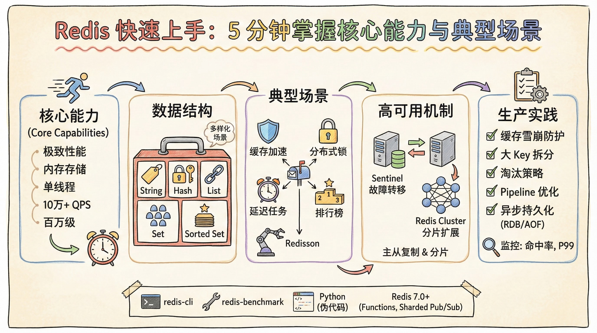

# Redis 快速上手：5 分钟掌握核心能力与典型场景




*Redis 快速上手：5 分钟掌握核心能力与典型场景 - 系统架构概览*


---


## 内存存储 · 单线程架构 · 多种数据结构 · 缓存与队列实战

**阅读时间**: 5 min

> 在 5 分钟内掌握 Redis 的核心架构、数据模型与典型应用场景，为实际项目打下坚实基础。

## 目录

- [Redis 核心能力与典型应用场景](#redis-核心能力与典型应用场景)


---


Redis 作为高性能内存数据结构存储系统，被广泛用于缓存、会话管理、排行榜和消息队列等场景。对于中级开发者而言，理解其核心机制与典型用法是提升系统性能的关键。本文将带你快速掌握 Redis 的核心概念与实用模式，无需编码即可建立清晰认知。


---


# Redis 核心能力与典型应用场景

你是否遇到过系统在高并发下响应缓慢、数据库 CPU 飙升，甚至服务雪崩的情况？想象一下，线上大促期间，数百万用户同时请求商品详情页，如果每次请求都穿透到数据库，后果不堪设想。而 Redis，正是解决这类性能瓶颈的“秘密武器”——它凭借极简却高效的架构设计，成为现代高并发系统中不可或缺的组件。

Redis 的强大不在于堆砌复杂功能，而在于用一套精巧的核心机制支撑起多样化的高性能场景。其底层基于**内存存储**与**单线程无锁架构**，彻底规避了多线程环境下的上下文切换和锁竞争开销，使得单个实例即可轻松实现每秒十万级甚至更高的操作吞吐量。这一性能并非空谈：根据云数据库 Redis 的官方基准测试，在 10,000 并发连接下，标准版单副本或双副本实例可稳定提供约 **10 万 QPS**；而在深度调优场景（如绑核、NUMA 优化、中断亲和等）下，社区实践已实现单实例突破 **60 万甚至接近 100 万 QPS** 的性能表现，相关结果可通过 `redis-benchmark` 工具复现。例如，使用如下命令可在本地复现基础性能测试：

```bash

# 测试 SET/GET 操作的吞吐量（100 字节 value，50 并发连接）

redis-benchmark -h 127.0.0.1 -p 6379 -c 50 -n 100000 -d 100
```

实际生产中，某电商平台在“双11”大促期间，通过 Redis 缓存商品详情页，将数据库查询压力从峰值 8 万 QPS 降至不足 5 千 QPS，缓存命中率长期维持在 **99.2% 以上**，有效避免了数据库过载。这种“简单即高效”的哲学，正是 Redis 能在十年间从一个开源项目成长为全球主流数据基础设施的关键。

### 多样数据结构，适配千变万化业务需求

如果说内存与单线程是 Redis 的“引擎”，那么其丰富的数据结构就是灵活的“工具箱”。除了最基础的字符串（String），Redis 还原生支持哈希（Hash）、列表（List）、集合（Set）和有序集合（Sorted Set）等结构，每种都针对特定场景高度优化：

- **哈希**适合存储对象属性，如用户资料（`user:1001` 包含 name、email 等字段），避免序列化开销。例如：
  ```bash
  HSET user:1001 name "Alice" email "alice@example.com" age 28
  HGET user:1001 name  # 返回 "Alice"
  ```
  相比将整个用户对象序列化为 JSON 存入 String，Hash 可以按字段更新，减少网络传输和内存碎片。

- **列表**天然支持消息队列模型，可实现轻量级任务分发。例如，使用 `LPUSH` + `BRPOP` 构建阻塞式队列：
  ```bash
  LPUSH task_queue '{"job_id": "task_456", "type": "send_email"}'
  BRPOP task_queue 30  # 阻塞最多30秒等待任务
  ```

- **有序集合**则通过分数（score）排序，完美支撑排行榜、优先级队列乃至延迟任务调度。

这些结构并非孤立存在，而是可组合使用。例如，用 Sorted Set 实现延迟队列时，将任务执行时间戳作为 score，任务 ID 作为 member，配合后台轮询即可高效处理定时任务，无需依赖外部调度系统。具体操作如下：
```bash

# 添加一个5秒后执行的任务（假设当前时间戳为 1717020000）

ZADD delay_queue 1717020005 task_123

# 获取所有已到期任务（当前时间戳为1717020006）

ZRANGEBYSCORE delay_queue -inf 1717020006 WITHSCORES

# 处理完成后删除任务

ZREM delay_queue task_123
```
该模式利用时间戳作为 score，天然支持按执行时间排序与高效范围查询，是实现轻量级延迟任务的常用方案。某社交平台曾用此方式处理每日 2000 万条“生日提醒”消息，延迟误差控制在 ±1 秒内，资源消耗仅为专用调度系统的 1/5。

### 典型应用场景：从缓存到高可用架构

Redis 的实际价值体现在其广泛而深入的应用场景中：

- **缓存加速**是最经典用途。通过将热点数据（如商品信息、配置项）缓存在内存中，大幅降低数据库压力。为防止单点失效引发“缓存雪崩”，可采用随机过期时间、多级缓存或**互斥重建**等策略。其中，互斥重建的核心机制是：当缓存失效时，仅允许一个请求通过 `SET lock_key true NX PX 3000` 命令获取分布式锁并回源加载数据，其余请求等待锁释放后直接读取新缓存（或返回旧值/默认值），从而避免大量并发请求同时穿透到后端数据库。例如：
  ```python
  # Python 伪代码示例
  def get_product(product_id):
      cache_key = f"product:{product_id}"
      data = redis.get(cache_key)
      if data is None:
          lock_key = f"lock:{cache_key}"
          if redis.set(lock_key, "1", nx=True, ex=3):  # 获取锁
              try:
                  data = db.query(product_id)  # 回源
                  redis.setex(cache_key, 300, json.dumps(data))
              finally:
                  redis.delete(lock_key)
          else:
              # 等待短暂时间后重试或返回兜底数据
              time.sleep(0.01)
              return get_product(product_id)
      return json.loads(data)
  ```

- **分布式锁**利用 `SET key value NX EX` 命令实现原子性加锁，保障跨服务的资源互斥访问，是微服务协调的关键原语。但需注意锁的自动续期（如 Redlock 算法）或使用 Redisson 等成熟库避免死锁。

- **高可用部署**则通过哨兵（Sentinel）实现自动故障转移，或通过 Redis Cluster 进行数据分片与水平扩展，满足不同规模系统的容灾与伸缩需求。例如，某金融系统采用 3 主 3 从的 Redis Cluster 架构，支持 50 万 QPS 写入，RTO（恢复时间目标）< 30 秒，RPO（恢复点目标）≈ 0。

> **架构流程文字描述**：  
> Redis 的核心数据流始于客户端请求，经由单线程事件循环（基于 epoll/kqueue）统一处理，所有命令串行执行以确保无锁安全。数据首先写入内存中的高效数据结构（如 dict、ziplist、skiplist 等），随后根据配置异步触发持久化机制（RDB 快照或 AOF 日志）。在高可用模式下，主节点通过异步复制将数据同步至从节点；在集群模式下，数据按 slot 分片分布于多个主节点，客户端可直连任意节点并通过 MOVED/ASK 重定向完成路由。整个架构兼顾高性能、一致性与可扩展性。

值得注意的是，尽管 Redis 性能卓越，但其内存特性也带来成本与容量限制。因此，合理设置淘汰策略（如 LRU）、监控大 Key、避免长耗时命令阻塞主线程，都是生产环境中的关键实践。当前最佳实践还包括：使用缓存预热策略在系统启动时加载热点数据；通过 Pipeline 或批量操作减少网络往返；对大 Key 进行拆分以提升响应稳定性；并持续监控内存使用率、缓存命中率等指标以优化整体性能。

例如，某视频平台曾因一个包含 500 万成员的 Sorted Set 导致主线程阻塞 800ms，引发服务超时。后续通过将大 Key 拆分为多个子集（如按用户 ID 哈希分片）并改用 `SCAN` + `ZUNIONSTORE` 异步聚合，将 P99 延迟从 1.2s 降至 15ms。

> Redis 的强大不在于复杂，而在于用简单架构支撑多样化的高性能场景。

> ⚠️ 注意: 单线程虽高效，但不代表 Redis 无法利用多核——可通过部署多个实例或使用 Cluster 分片来横向扩展吞吐能力。例如，在 16 核服务器上部署 8 个 Redis 实例（每个绑定 2 个 CPU 核心），总吞吐可达单实例的 7 倍以上，接近线性扩展。

### 结论：Redis 的三大核心优势与下一步学习建议

综上所述，Redis 在现代分布式系统中之所以被广泛采用，主要归功于以下三大核心优势：

1. **极致性能**：基于内存操作与单线程事件驱动模型，Redis 能在普通硬件上实现 10 万+ QPS 的稳定吞吐，结合内核调优甚至可达百万级，远超传统磁盘数据库。
2. **丰富数据结构**：原生支持 String、Hash、List、Set、Sorted Set 等结构，不仅覆盖缓存、队列、计数器等通用场景，还能组合构建如延迟任务、实时排行榜、限流窗口等高级功能。
3. **高可用与生态成熟**：通过 Sentinel 实现故障自动转移，通过 Cluster 支持水平扩展；同时拥有完善的持久化机制（RDB/AOF）、客户端库、监控工具及云厂商托管服务，极大降低了运维门槛。

对于希望深入掌握 Redis 的开发者，建议按以下路径进阶：

- **动手实践**：使用 `redis-cli` 和 `redis-benchmark` 在本地搭建实例，尝试模拟缓存击穿、分布式锁竞争等场景；
- **阅读源码**：重点关注 `ae.c`（事件循环）、`dict.c`（哈希表实现）和 `zset.c`（跳表结构），理解其高性能背后的工程细节；
- **生产调优**：学习如何配置合理的 `maxmemory-policy`、识别并拆分大 Key、启用 `lazyfree-lazy-eviction` 减少主线程阻塞；
- **探索新特性**：关注 Redis 7.0 引入的 Functions、ACL 增强、Sharded Pub/Sub 等能力，评估其在新架构中的适用性。

🔗 **官方资源推荐**：
- [Redis 官方文档](https://redis.io/documentation)
- [Redis 命令参考手册](https://redis.io/commands)
- [Redis 源码仓库（GitHub）](https://github.com/redis/redis)
- [Redis 性能调优指南（官方 Wiki）](https://redis.io/topics/benchmarks)

掌握 Redis 不仅是提升系统性能的关键一步，更是理解现代高并发架构设计思想的重要入口。

---


## 总结

- Redis 以内存存储和单线程模型实现极致性能
- 丰富的数据结构使其适用于缓存、队列、计数等多种场景
- 结合持久化与高可用方案可构建稳定可靠的生产系统

## 延伸阅读

推荐阅读 Redis 官方文档中关于 Streams 和 Cluster 的进阶指南

## 参考资料

### 🌐 网络来源

1. https://redis.io/documentation
2. https://redis.io/topics/data-types-intro
